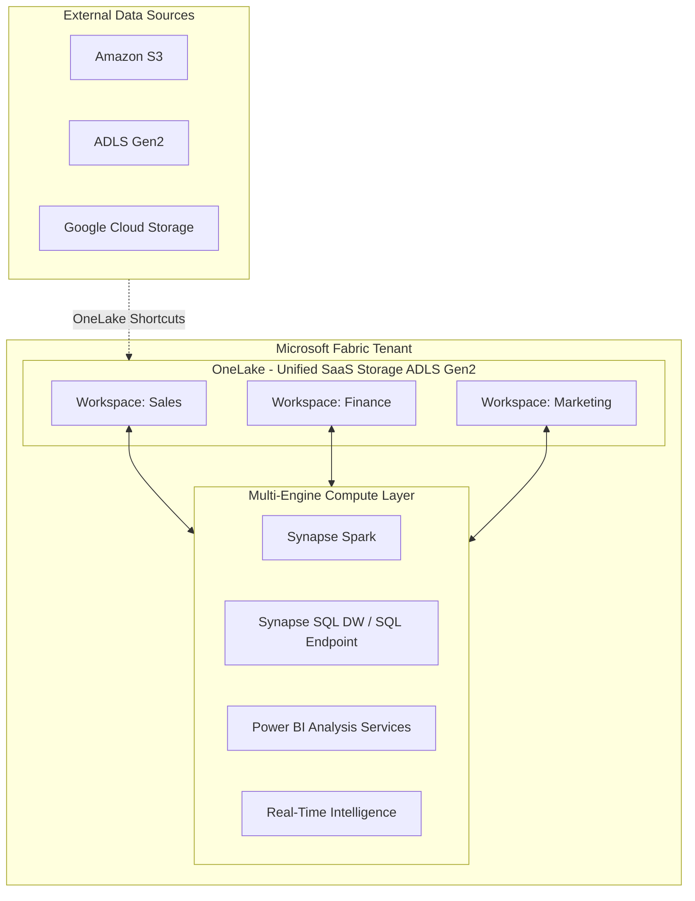
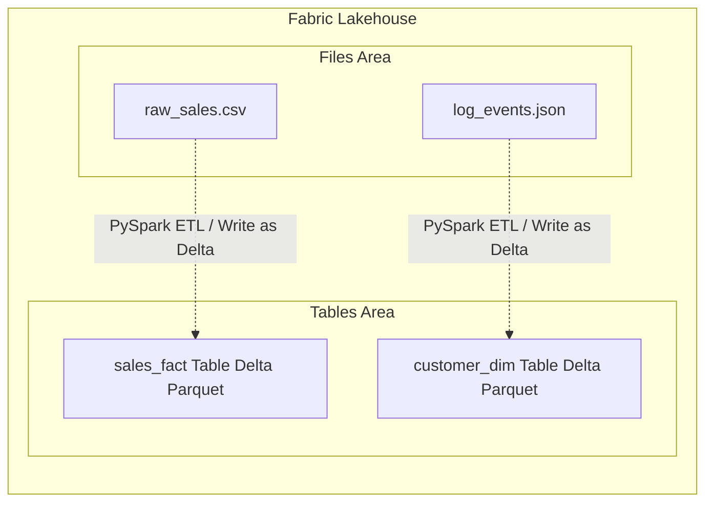
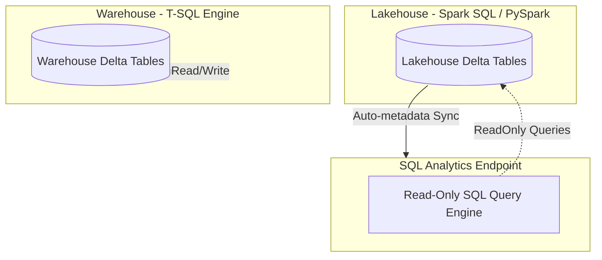
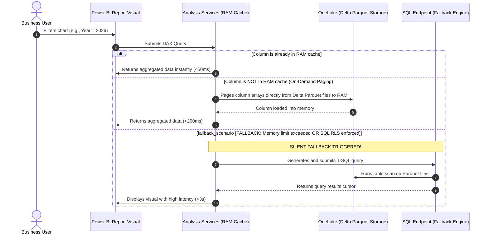
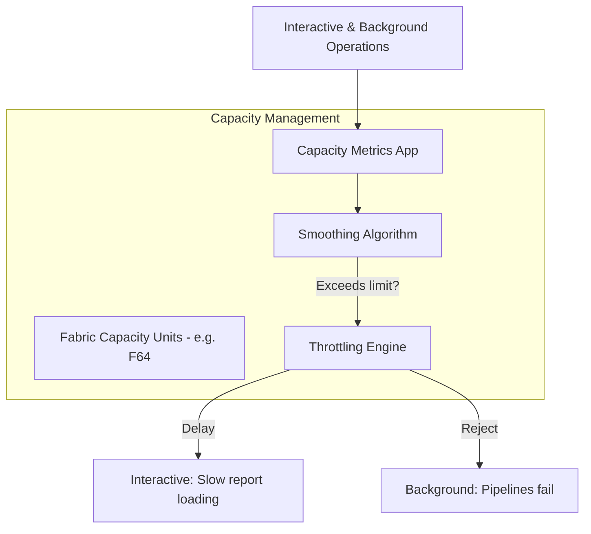

# DP-600 Fabric Analytics Engineer Study Companion Notebook – Lakehouse, Warehouse, Direct Lake & Semantic Models
**By Datta Sable | Data Platform Architect & BI Expert**

* **Meta Description**: Pass your DP-600 Fabric Analytics Engineer exam. Study this master-class companion covering OneLake, Lakehouse architecture, Fabric Warehouse, Direct Lake mode, Semantic Models, and DAX. (160 characters)
* **URL Slug**: `/blog/dp-600-fabric-analytics-engineer-study-companion-notebook`
* **LSI Keywords**: OneLake shortcuts, V-Order optimization, Delta Lake transaction log, Direct Lake fallback, SQL Endpoint, Star Schema, context transition, capacity metrics app, workspace roles, Row-Level Security (RLS).

---

## Introduction & Exam Overview

As I prepare for the **DP-600: Implementing Analytics Solutions Using Microsoft Fabric** certification, I created this notebook as a consolidated study companion covering the concepts that appear most frequently across Microsoft Learn modules, hands-on labs, and practice assessments.

The goal of this notebook is not just to help with exam preparation, but also to provide a practical reference for analytics engineers working with Microsoft Fabric in real-world projects.

For over 10 years working in Business Intelligence, Power BI, SQL, reporting automation, and analytics engineering, I noticed that many professionals understand Power BI very well but struggle to connect the broader Microsoft Fabric ecosystem together. This notebook serves as a practical bridge between:
- Power BI
- Fabric Lakehouse
- Fabric Warehouse
- OneLake
- Semantic Models
- Governance and Monitoring

---

## 1. OneLake Fundamentals

### SaaS Architecture & OneLake Design Principles
OneLake is the "OneDrive for data." It is a single, unified, logical data lake for your entire organization, provisioned automatically with every Microsoft Fabric tenant. It is built on top of Azure Data Lake Storage (ADLS) Gen2 and supports the same APIs and SDKs.



#### The Three Core Pillars of OneLake Architecture:
1. **Single Copy Concept**: Data is stored once in OneLake in an open-source standard format (Delta Parquet) and accessed by multiple computing engines (Spark, SQL, Power BI) without copying or transforming it.
2. **Shortcuts**: Virtual files that reference data stored in other locations (external ADLS Gen2, Amazon S3, Google Cloud Storage, or other Fabric workspaces) without moving it. This enables a distributed data mesh architecture.
3. **SaaS Integration**: No infrastructure to provision. Security, compliance, performance, and scaling are managed entirely by Fabric.

### Data Organization & Governance Concepts
Within OneLake, data is organized hierarchically:
- **Tenant**: The root of the organization.
- **Workspaces**: The primary administrative and boundary unit for security, collaboration, and capacity.
- **Items**: Lakehouses, Warehouses, Semantic Models, and Reports stored within workspaces.

To govern this architecture, Microsoft Fabric uses **Domains** and **Sub-domains**. You can group workspaces into logical domains (e.g., "Finance", "Operations", "Sales") and assign Domain Contributors and Admins. This allows centralized IT to delegate domain management to business departments.

### Workspace Strategy Recommendations
When planning your Fabric workspace strategy, consider the following best practices:
- **Separate by Environment**: Create separate workspaces for development, testing, and production (`Sales_Dev`, `Sales_Test`, `Sales_Prod`).
- **Separate by Domain & Team Boundary**: Group items by data ownership. Do not mix Finance and HR data in the same workspace unless they share the same security boundaries.
- **Leverage Shortcuts**: Instead of copying data across workspaces, create a shortcut in the destination workspace pointing to the source Lakehouse.

---

## 2. Lakehouse Architecture

### Files vs Tables
A Fabric Lakehouse consists of two distinct areas in OneLake storage:
1. **Files (Unmanaged/External)**: A landing zone for raw, unstructured, semi-structured, or structured files (CSV, JSON, XML, images, Parquet). These files can be read by Spark notebooks, but do not automatically expose a SQL relational schema.
2. **Tables (Managed)**: Structured tables stored in Delta Parquet format. Any table created here is automatically registered in the Fabric Metastore and becomes instantly queryable using the SQL Endpoint and Spark SQL.



### Delta Lake Fundamentals
Delta Lake is an open-source storage layer that brings ACID transactions to Apache Spark and big data workloads. Under the hood, a Delta Table consists of:
- **Parquet files**: Columnar data files containing the actual table records.
- **The transaction log (`_delta_log/`)**: A folder containing JSON files (`00000000000000000000.json`, etc.) that record every action taken on the table (inserts, updates, deletes, schema changes).

#### ACID Properties in Fabric:
- **Atomicity**: Writes either succeed completely or fail completely.
- **Consistency**: The schema is enforced on write, preventing corrupt data.
- **Isolation**: Readers see a consistent snapshot of the data, even while writes are occurring (Optimistic Concurrency Control).
- **Durability**: Changes are committed directly to OneLake persistent storage.

### Medallion Architecture Implementation Patterns
The Medallion architecture (Bronze, Silver, Gold) is the standard pattern for data curation in Microsoft Fabric:

| Layer | Purpose | Format | Fabric Tool | Optimization Heuristics |
| :--- | :--- | :--- | :--- | :--- |
| **Bronze (Raw)** | Land source data as-is, retaining all history and schema anomalies. | Files (CSV, Parquet, JSON) | Data Factory / Spark | Append-only, partitioned by date of ingestion. |
| **Silver (Cleaned)** | De-duplicated, schema-validated, cleaned, and enriched data. | Delta Tables | Spark Notebooks | Upsert (Merge), V-Order enabled, partitioned by business keys. |
| **Gold (Curated)** | Highly aggregated, dimensional model (Star Schema) ready for BI reports. | Delta Tables | Spark / Data Factory | V-Order optimized, Z-Order by query filter columns, Liquid Clustering. |

#### PySpark Code: Implementing Medallion Transformation
Here is how you ingest raw files from Bronze, transform them, and write them into Silver/Gold Delta tables with V-Order enabled:

```python
# 1. Read raw CSV from Files (Bronze)
df_raw = spark.read.format("csv") \
    .option("header", "true") \
    .option("inferSchema", "true") \
    .load("Files/Bronze/sales_raw.csv")

# 2. Perform transformations, renaming, and cleaning (Silver)
from pyspark.sql.functions import col, to_date, trim

df_silver = df_raw.select(
    col("SalesOrderNumber").alias("order_id"),
    to_date(col("OrderDate"), "yyyy-MM-dd").alias("order_date"),
    trim(col("CustomerEmail")).alias("customer_email"),
    col("UnitPrice").cast("double").alias("unit_price"),
    col("Quantity").cast("integer").alias("quantity")
).filter(col("order_id").isNotNull())

# 3. Write to Managed Tables (Silver) with V-Order optimization enabled by default in Fabric
df_silver.write.format("delta") \
    .mode("overwrite") \
    .saveAsTable("silver_sales")

# 4. Optimize the Silver table (Time Travel maintenance / Z-Order compaction)
spark.sql("OPTIMIZE silver_sales ZORDER BY (order_date)")
```

---

## 3. Data Warehouse Concepts

### Synapse Data Warehouse Architecture in Fabric
Fabric Data Warehouse is a fully relational, transactionally consistent SQL database that stores its underlying data as Delta Parquet files in OneLake. Unlike the Lakehouse, which relies primarily on Spark for write operations, the Warehouse relies entirely on a SQL query engine (Polaris) to run DDL, DML, and queries using standard T-SQL.



### SQL Endpoint vs Warehouse Decision Framework
Every Lakehouse automatically provisions a **SQL Analytics Endpoint**. This is a read-only SQL connection that allows you to query the Lakehouse tables using T-SQL, write views, and build semantic models. However, you cannot write standard `INSERT`, `UPDATE`, or `DELETE` statements against it.

Here is the decision framework to choose between them:

| Capability / Attribute | Lakehouse SQL Analytics Endpoint | Fabric Data Warehouse |
| :--- | :--- | :--- |
| **Write Capability** | Read-Only from SQL. Write must be done via Spark, Pipelines, or Dataflow Gen2. | Read-Write. Full support for T-SQL DDL/DML (`INSERT`, `UPDATE`, `DELETE`, `MERGE`). |
| **Primary Persona** | Data Engineers, Data Scientists, Analytics Engineers. | Relational Database Developers, BI Developers, SQL Analysts. |
| **Asset Support** | Supports both files (unstructured) and tables. | Supports tables, views, schemas, functions, procedures. No direct file access. |
| **Security Support** | SQL-based security (RLS/OLS/Column-Level) at SQL endpoint level only. | Complete schema, table, column, and row-level security natively inside SQL. |
| **Transaction Boundaries** | Determined by Delta log of individual tables. | Multi-table transactions, full transactional isolation (ACID). |

### Query Performance Considerations
To optimize query performance in the SQL Endpoint or Warehouse:
1. **Analyze Statistics**: The SQL engine automatically generates and updates statistics. If queries degrade, manually trigger statistics collection using:
   ```sql
   CREATE STATISTICS stat_sales_date ON dbo.fact_sales(order_date);
   ```
2. **Partition Pruning**: Ensure your queries filter on partitioned columns. If a table is partitioned by Year/Month, filtering by `OrderYear = 2026` allows the query planner to skip scanning files for other years.
3. **Avoid Complex Views on Views**: Nested views prevent the query optimizer from generating efficient execution plans. Materialize complex intermediate joins in upstream Delta tables instead.

---

## 4. Direct Lake Mode

### Direct Lake Architecture
Direct Lake is a path-breaking technology in Microsoft Fabric that connects Power BI directly to OneLake Delta Parquet tables without copying data. 

In traditional configurations:
- **Import Mode**: Loads data into the Power BI Analysis Services (AS) memory cache. It is ultra-fast but requires scheduled refreshes.
- **DirectQuery Mode**: Translates DAX queries to SQL queries at runtime, sending them to the database engine. This avoids data copy but suffers from high latency and resource contention.

**Direct Lake mode** bypasses the SQL database engine entirely. When a visual requests data, the Power BI AS engine loads columns of the Delta Parquet files directly from OneLake storage into RAM. 



### Direct Lake Fallback Analysis
Under certain conditions, Power BI cannot query OneLake Parquet files directly and silently falls back to **DirectQuery mode**. This degrades report performance significantly.

| Trigger Condition | Cause | Mitigation Strategy |
| :--- | :--- | :--- |
| **Capacity Limit Exceeded** | The memory size of the semantic model columns loaded into RAM exceeds the threshold allocated to the Fabric Capacity (e.g., F2/F4 vs F64). | 1. Implement vertical partitioning (remove unused columns).<br>2. Reduce cardinality of key columns.<br>3. Upgrade Capacity Unit (CU) size. |
| **Database-Level RLS / OLS** | Row-Level Security (RLS) or Object-Level Security (OLS) is defined inside the Lakehouse SQL Endpoint or Warehouse database, rather than the Semantic Model. | Define all RLS/OLS configurations **directly in the Power BI Semantic Model** using DAX, keeping database permissions open for the Power BI identity. |
| **Schema Changes** | The schema of the underlying Delta table changed (e.g., column renamed or deleted) without updating the Semantic Model. | Keep the Semantic Model synchronized with the Delta table, and trigger model schema sync through the Web modeler. |
| **Views Usage** | The semantic model points to a SQL View instead of a physical Delta Table in the Lakehouse/Warehouse. | Point your Semantic Model directly to physical Delta tables. Avoid modeling on top of views if you want pure Direct Lake speed. |

---

## 5. Semantic Models

### Star Schema Best Practices
For maximum performance in Fabric Semantic Models (especially in Direct Lake mode), you must design a clean **Star Schema** consisting of Fact and Dimension tables:
- **Fact Tables**: Contain quantitative metrics (Sales Amount, Quantity, Temperature) and foreign keys referencing dimensions.
- **Dimension Tables**: Contain descriptive attributes (Customer Name, Product Category, Store Region) used to filter and group data.

*Avoid Snowflake schemas* (where dimension tables join to other dimension tables). Snowflakes create complex join paths that force Analysis Services to scan more memory arrays and can trigger fallbacks in Direct Lake.

### Relationship Design
- **One-to-Many (`1:*`)**: The gold standard. The "one" side must always reside in the Dimension table, and the "many" side in the Fact table.
- **Single Cross-Filter Direction**: Ensure the cross-filter direction is set to **Single** (Dimension filters Fact). Avoid bidirectional filters (`1:*` with bidirectional filtering) because they introduce ambiguity, circular reference risks, and severely degrade performance.
- **Use Inactive Relationships with `USERELATIONSHIP`**: If a Fact table has multiple date columns (e.g., `OrderDate`, `ShipDate`), create one active relationship (e.g., to `OrderDate`) and inactive relationships to the others. In your DAX measures, use `USERELATIONSHIP` to activate the ship date calculation.

```dax
Shipped Sales = 
CALCULATE(
    [Total Sales],
    USERELATIONSHIP(fact_sales[ShipDateKey], dim_date[DateKey])
)
```

### Model Optimization Techniques
To minimize memory footprint and ensure Direct Lake operations stay within capacity limits:
1. **Disable Auto Date/Time**: Go to Options -> Data Load -> and uncheck "Auto date/time for new files". This prevents Power BI from generating hidden local date tables for every datetime column, which wastes massive amounts of memory.
2. **Cardinality Reduction**: Cardinality refers to the number of unique values in a column. Avoid importing high-cardinality columns (like GUIDs, transactional timestamps, or notes fields) into the semantic model unless strictly necessary.
3. **Optimize Data Types**: Cast high-precision floats to fixed decimals (currency) or integers if the precision isn't required. Analysis Services compresses integers much better than floats.

---

## 6. DAX Reference Section

This reference guide contains the foundational patterns required to pass the DAX portion of the DP-600 exam.

### CALCULATE
`CALCULATE` is the most important function in DAX. It evaluates an expression in a modified filter context.

```dax
-- Pattern: Basic CALCULATE modifying context
US Sales = 
CALCULATE(
    [Total Sales],
    dim_customer[Country] = "United States"
)
```

#### Under the Hood:
1. `CALCULATE` takes the current filter context.
2. It evaluates its filter arguments.
3. If a filter argument is defined on a column that already has a filter, the new filter replaces the old one. If not, the new filter is added.
4. It executes the calculation under this new filter context.

### FILTER
`FILTER` is an iterator function that returns a table. It should only be used when filtering a table expression by a condition that cannot be evaluated using simple column filters (e.g., comparing a measure value).

```dax
-- Pattern: Using FILTER to scan aggregated measure values
High Value Customers Sales = 
CALCULATE(
    [Total Sales],
    FILTER(
        VALUES(dim_customer[CustomerKey]),
        [Total Sales] > 10000
    )
)
```

> [!WARNING]
> **Performance Gotcha**: Do not write `FILTER(dim_customer, dim_customer[Country] = "USA")`. Since `FILTER` scans every row of the table parameter, passing the entire `dim_customer` table degrades performance. Use simple filters inside `CALCULATE` or filter a specific column using `KEEPFILTERS`.

### Time Intelligence
To write time intelligence measures, you MUST have a dedicated `dim_date` table marked as a Date table in your model.

```dax
-- 1. Year-to-Date (YTD) Sales
Sales YTD = 
TOTALYTD(
    [Total Sales],
    dim_date[Date]
)

-- 2. Sales Same Period Last Year (SPLY)
Sales SPLY = 
CALCULATE(
    [Total Sales],
    SAMEPERIODLASTYEAR(dim_date[Date])
)

-- 3. Running Total (Custom Time Intelligence)
Running Total Sales = 
CALCULATE(
    [Total Sales],
    FILTER(
        ALLSELECTED(dim_date),
        dim_date[Date] <= MAX(dim_date[Date])
    )
)
```

### Context Transition Examples
**Context Transition** occurs when a row context is transformed into a filter context. This happens automatically when:
1. A measure is reference inside an iterator function (like `SUMX`, `AVERAGEX`, `FILTER`).
2. An explicit `CALCULATE` is called within a row context.

#### Example Scenario:
Imagine we have a calculated column in the `dim_product` table:

```dax
-- WITHOUT CALCULATE: Row Context only. 
-- Evaluates the sum of all sales in the entire table, repeated for every product.
Bad Product Sales Column = SUM(fact_sales[SalesAmount])

-- WITH CALCULATE (Context Transition triggered):
-- The product key in the row context is converted into a filter context.
-- Evaluates the sum of sales for THAT specific product.
Correct Product Sales Column = CALCULATE(SUM(fact_sales[SalesAmount]))
```

---

## 7. Security & Governance

### Workspace Roles
Workspace permissions control what items users can see and modify.

| Role | Publish/Create Items | Edit/Delete Items | Modify Workspace Members | Share Items (Direct link) |
| :--- | :---: | :---: | :---: | :---: |
| **Admin** | Yes | Yes | Yes | Yes |
| **Member** | Yes | Yes | No (Unless permitted) | Yes |
| **Contributor** | Yes | Yes | No | No |
| **Viewer** | No | No | No | No (Read-Only) |

*Important for DP-600*: Contributor role is ideal for developers who write code but shouldn't manage membership. Viewers can only view report visuals and cannot access underlying Lakehouse files directly unless SQL permissions are granted.

### Row-Level Security (RLS) & Object-Level Security (OLS)
- **Row-Level Security (RLS)**: Filters the rows of a table based on user credentials (using `USERPRINCIPALNAME()`). RLS should be defined in the Power BI Semantic Model for Direct Lake configurations to avoid database-level silent fallback.
- **Object-Level Security (OLS)**: Restricts access to entire tables or columns. If a column is secured via OLS, users without permission cannot see it or write queries referencing it (queries will return an error).

### Data Lineage & Endorsements
Fabric provides end-to-end **Lineage View**, showing the entire lifecycle of data from the source (e.g., ADLS Gen2 shortcut) through Lakehouse, SQL Warehouse, Semantic Model, to the final Power BI Report.

To help users find trusted data, items can be tagged with **Endorsements**:
1. **Promoted**: Workspace members can promote items they believe are complete and ready for use.
2. **Certified**: Only authorized tenant admins or specific security groups can certify items. This is the highest trust validation for enterprise semantic models.

---

## 8. Monitoring & Administration

### Capacity Monitoring & Metric Analysis
Fabric runs on allocated **Capacity Units (CUs)**. To track usage, you must install the **Microsoft Fabric Capacity Metrics App**.

Key concepts measured in the metrics app:
- **Interactive Operations**: Short-duration queries (e.g., a user filtering a report visual). These are processed instantly and charged against the capacity.
- **Background Operations**: Long-running background processes (e.g., data pipeline runs, Spark notebook execution, Semantic Model refreshes).
- **Smoothing**: Fabric averages capacity consumption over a 24-hour window for background operations, and over a 10-minute window for interactive operations. This prevents momentary query spikes from throttling your tenant.
- **Throttling**: If consumption exceeds 100% of capacity limits after smoothing, Fabric implements progressive throttling (delays interactive queries first, then blocks background runs).



### Deployment Pipelines
Fabric deployment pipelines automate release management:
- **Phases**: Development -> Test -> Production.
- **Supported Items**: Lakehouses (structure only, not the underlying Parquet data files), Warehouses, Semantic Models, and Reports.
- **Deployment Rules**: You can define rules to dynamically modify source database connections, SQL parameters, and semantic model connections as metadata transitions between dev, test, and prod.

---

## Conclusion & Study Strategy

To pass the DP-600 exam:
1. Focus heavily on **Direct Lake Mode fallback rules** and **V-Order optimization**.
2. Learn to write clean DAX time-intelligence calculations, and understand **context transition**.
3. Master the architectural differences between a **Lakehouse (Spark-centric)** and a **Warehouse (SQL-centric)**.
4. Practice tracking CU metrics to debug performance bottlenecks.

Good luck to everyone pursuing Microsoft Fabric certifications!

---

## Frequently Asked Questions (FAQ)

### What is the difference between V-Order and Z-Order in Microsoft Fabric?
**V-Order** is a proprietary write optimization technology in Microsoft Fabric that rearranges data inside Parquet files to enable extremely fast sorting and filtering for the Power BI Analysis Services engine. It is applied by default to all tables written by Fabric Spark and Warehouse engines.
**Z-Order** is an open-source multidimensional clustering technique that organizes data based on specified columns to reduce the volume of data scanned by Spark and SQL engines. V-Order and Z-Order can be used together on the same table.

### How do I check if my Power BI report has fallen back to DirectQuery mode?
You can connect to the Semantic Model XMLA endpoint using DAX Studio and run a DMV query on `$System.DISCOVER_MDC_DETAILS` or check the `DirectLakeActive` column in SQL Profiler trace events. If the value is `0` or `False`, fallback has occurred.

### Can I enforce Row-Level Security (RLS) in OneLake files directly?
No. Security on OneLake files is managed via Workspace Roles or Share permissions. RLS is enforced at the computing engine level—either in the SQL Endpoint / Warehouse engine or inside the Power BI Semantic Model. For Direct Lake mode, RLS must be defined in the Semantic Model.

---

<script type="application/ld+json">
{
  "@context": "https://schema.org",
  "@type": "TechArticle",
  "headline": "DP-600 Fabric Analytics Engineer Study Companion Notebook – Lakehouse, Warehouse, Direct Lake & Semantic Models",
  "description": "Prepare for the DP-600 certification with this master-class study companion notebook. Covers OneLake, Lakehouse architecture, Fabric Warehouse, Direct Lake mode, Semantic Models, DAX patterns, security, and capacity monitoring.",
  "image": "https://dattasable.com/images/blog/DP-600 Fabric Analytics Engineer Study Companion Notebook.webp",
  "author": {
    "@type": "Person",
    "name": "Datta Sable"
  },
  "publisher": {
    "@type": "Organization",
    "name": "Datta Sable",
    "logo": {
      "@type": "ImageObject",
      "url": "https://dattasable.com/images/dattasable.com.webp"
    }
  },
  "mainEntityOfPage": {
    "@type": "WebPage",
    "@id": "https://dattasable.com/blog/dp-600-fabric-analytics-engineer-study-companion-notebook"
  },
  "datePublished": "2026-06-25",
  "dateModified": "2026-06-25",
  "mainEntity": [
    {
      "@type": "Question",
      "name": "What is the difference between V-Order and Z-Order in Microsoft Fabric?",
      "acceptedAnswer": {
        "@type": "Answer",
        "text": "V-Order is a proprietary write optimization technology in Microsoft Fabric that rearranges data inside Parquet files to enable fast sorting for Power BI. Z-Order is an open-source multidimensional clustering technique that organizes data to reduce data scanned by Spark and SQL engines."
      }
    },
    {
      "@type": "Question",
      "name": "How do I check if my Power BI report has fallen back to DirectQuery mode?",
      "acceptedAnswer": {
        "@type": "Answer",
        "text": "You can connect to the Semantic Model XMLA endpoint using DAX Studio and run a DMV query on $System.DISCOVER_MDC_DETAILS or check the DirectLakeActive column in SQL Profiler trace events."
      }
    }
  ]
}
</script>
