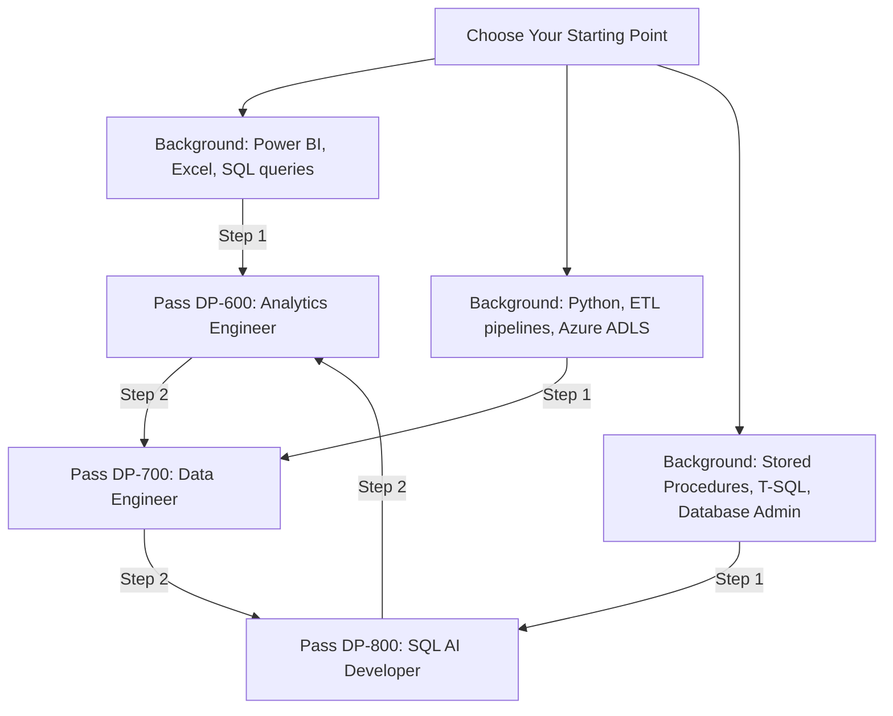

# Free Microsoft Fabric Certification Voucher 2026: Complete Guide to DP-600, DP-700 & DP-800 (With Proof)

* **Author**: Datta Sable
* **Date**: June 24, 2026
* **Category**: Architecture & BI
* **URL Slug**: `/blog/free-microsoft-certifications-fabric-data-days-2026`
* **Meta Description**: Earn a 100% free Microsoft Fabric certification voucher for the DP-600, DP-700, or DP-800 exams. Read my real proof of approval, eligibility steps, and study guides.
* **Featured Image**: /images/blog/free-microsoft-certifications-fabric-data-days.webp
* **Target Audience**: Data Analysts, Power BI Developers, Data Engineers, BI Professionals, SQL Developers, Microsoft Fabric Learners, Professionals seeking free Microsoft certifications.

---

## Introduction: A Personal Success Story

It was a quiet Tuesday morning when I opened my inbox and saw a notification that immediately grabbed my attention. The subject line read: **"Your Data Days free exam voucher!"** 

Opening it, I found a congratulatory message from the Microsoft Fabric Community containing a 100% discount voucher code. Having worked in business intelligence, SQL engineering, and analytics architecture for over a decade, I’ve seen certifications come and go. But this voucher represented something special—a direct, zero-cost ticket to validate expertise on the most talked-about data platform in the enterprise world today: Microsoft Fabric.

For many professionals, staying competitive in the rapidly shifting tech landscape is a constant financial and time investment. A single Microsoft Associate-level exam registration fee is usually $165 USD (around ₹4,800 INR plus local taxes). If you are looking to take multiple exams, the cost quickly spirals into hundreds of dollars. For data analysts, Power BI developers, and database engineers, this price tag is a significant barrier to career advancement.

That is why Microsoft's current campaign is causing such a stir. Through the **Fabric Data Days 2026** initiative, Microsoft is giving away free certification vouchers for three of its core data and AI exams: the **DP-600**, the **DP-700**, and the newly launched **DP-800**. 

I personally went through the entire qualification flow, completed the requirements, and successfully received my voucher. In this comprehensive guide, I will break down exactly how you can qualify for your free voucher, compare the eligible certifications, share key dates, and help you select the ideal study path to fast-track your data career in 2026.

---

## Proof – Voucher Successfully Received

Before we look at the eligibility steps, let's address the most common question: *Is this promotion actually real, or is it just marketing hype?* 

Below is the direct proof. The screenshot is my actual voucher confirmation received in my Microsoft Fabric Community private message inbox. 

> [!NOTE]
> The screenshot below is my actual voucher notification received from Microsoft Fabric Community. The alphanumeric voucher code has been intentionally hidden for security reasons.


As you can see, the Fabric Team issues these vouchers directly through their community platform to users who complete the active campaign requirements. The process is fully automated once you submit your request form and your learning achievements are audited.

---

## Why Microsoft Fabric Certifications Matter in 2026

The enterprise data stack is consolidating. Historically, companies maintained separate data silos: one vendor for data ingestion, another for the storage lakehouse, another for the SQL warehouse, and yet another for BI visualization. This fragmentation created what architects call the "data copy tax"—copying and moving data repeatedly across platforms, causing latency, costs, and security risks.

Microsoft Fabric is designed to eliminate this tax by introducing **OneLake**, a unified SaaS data lake storing data in the open-source Delta Parquet format. Under Fabric’s multi-engine architecture, data engineers can transform data using Spark, database developers can query it using T-SQL, and BI professionals can build dashboards in Power BI—all pointing to the same physical file in OneLake. For a deep dive into how Fabric resolves multi-engine transactions, read our [Microsoft Fabric Architectural Guide](/blog/microsoft-fabric-architectural-guide).

As enterprises migrate to Fabric, the demand for certified talent is surging. Holding a Microsoft certification is no longer just about having an acronym on your resume; it proves you understand how to navigate a unified SaaS environment. 

### Global Salary Insights (2026)
Certified Fabric professionals command a premium in the job market. Based on hiring trends in mid-2026, here are the average annual compensation ranges for certified mid-level roles:

* **India**: ₹12,00,000 to ₹25,00,000 per annum, with higher rates for engineers who understand Direct Lake optimization and Spark scripting.
* **United States**: \$110,000 to \$165,000 / year.
* **Europe & UK**: £65,000 to £100,000 / year.

Whether you are a data analyst looking to transition to an analytics engineer, a cloud developer shifting to data engineering, or a database administrator building AI solutions, these certifications provide the necessary validation to stand out.

---

## What Is Microsoft Fabric Data Days 2026?

**Fabric Data Days 2026** is Microsoft’s premier community-driven upskilling campaign. Recognizing the rapid adoption of Fabric, Microsoft designed this program to bridge the talent gap by offering high-quality, free training and direct exam incentives.

The structure of the event involves three pillars:
1. **Interactive Webinars**: Live and on-demand sessions hosted by Microsoft Product Groups, FastTrack architects, and MVPs.
2. **Microsoft Learn Collections**: Structured study modules covering data ingestion, lakehouse creation, semantic modeling, and SQL AI coding.
3. **Community Hub**: Forums where learners can ask questions, collaborate on challenges, and verify their eligibility.

By combining structured learning with a free certification exam voucher, Microsoft encourages hands-on practice, ensuring that the community builds actual technical competency rather than just memorizing answers.

---

## Step-by-Step Qualification Guide: How to Get Your Voucher

To qualify for the free exam voucher, you must follow the campaign guidelines exactly. Here is the step-by-step walkthrough of the process I used to get approved:

### Step 1: Join the Microsoft Fabric Community
First, you must create a profile on the [Microsoft Fabric Community](https://community.fabric.microsoft.com). This step is critical because the vouchers are not distributed via email. They are sent directly as a **Private Message (PM)** on the community portal. Make sure your profile username is set up and active.

### Step 2: Register for the Fabric Data Days 2026 Event
Visit the official Data Days landing page and sign up. Ensure that the Microsoft Account (MSA) or corporate account you use to register is the same account you use for the community portal.

### Step 3: Watch the Technical Sessions
You are required to watch at least **two technical sessions** from the Data Days schedule. These sessions can be viewed live or watched on-demand if you miss the broadcast dates. The systems track your viewing progress via your registered login credentials.

### Step 4: Complete the Microsoft Learn Modules
Locate the official Data Days learning collections on Microsoft Learn and complete at least **three modules**. To ensure your progress is recorded correctly, verify that your Microsoft Learn profile is linked to your community account. If you need a refresher on building end-to-end data flows, take a look at our [Microsoft Fabric Medallion Architecture Guide](/blog/microsoft-fabric-medallion-architecture-guide).

### Step 5: Submit the Voucher Request Form
Once you have met the session and learning module requirements, open the official **Voucher Request Form** on the community portal. Enter your details, double-check your community username, and submit.
* **Official Form Link**: [Microsoft Fabric Community Campaign Form](https://community.fabric.microsoft.com/t5/custom/page/page-id/campaign_form?campaignID=Y2FtcGFpZ24tMTc4MTEwNTMxMDAxMQ==) (Make sure you are logged in to the community site).

### Step 6: Wait for Verification and Receive Confirmation
Microsoft's backend team will audit your learning records and viewing logs. This audit usually takes about **1 to 2 weeks**. Once approved, you will receive a notification in your community inbox containing your voucher code.

---

## Eligible Certifications: DP-600 vs DP-700 vs DP-800

The Fabric Data Days campaign allows you to request a free voucher for one of three associate-level exams. To make an informed choice, read our detailed [DP-600 vs DP-700 vs DP-800 Microsoft Fabric Certification Comparison](/blog/dp-600-vs-dp-700-vs-dp-800-microsoft-fabric-certification-comparison). Here is a breakdown of what each exam covers:

### 1. DP-600: Microsoft Certified: Fabric Analytics Engineer Associate
The DP-600 exam is designed for professionals who sit between raw data ingestion and end-user visualization. It focuses heavily on designing clean schemas and building optimized semantic models.

* **Who Should Take It**: Data Analysts, Power BI Developers, and BI Specialists looking to transition into Analytics Engineering.
* **Skills Covered**: Ingesting data via Dataflows Gen2, managing Delta Lake tables, designing star schemas, writing complex DAX expressions, setting up row-level security (RLS), and implementing Git version control.
* **Difficulty Level**: Intermediate. The primary challenges are understanding DAX context transition and configuring Direct Lake models to prevent performance fallbacks. For help with dashboard design best practices, read our guide on the [Psychology of High-Fidelity Dashboard Design](/blog/psychology-of-high-fidelity-dashboard-design).

### 2. DP-700: Microsoft Certified: Fabric Data Engineer Associate
The DP-700 exam focuses on scalable data pipelines, data lake architecture, and performance optimization. It is the core credential for building enterprise-grade data platforms.

* **Who Should Take It**: Data Engineers, ETL Developers, and Cloud Engineers migrating workloads to Fabric.
* **Skills Covered**: Building ingestion pipelines with Data Factory copy activities, writing scalable Spark notebooks (PySpark/Spark SQL), structuring Medallion architectures (Bronze, Silver, Gold), configuring capacity scaling, and establishing network security (Private Links).
* **Difficulty Level**: Medium-High. Requires a solid grasp of Python coding and Spark distributed processing mechanics.

### 3. DP-800: Microsoft Certified: SQL AI Developer Associate
The DP-800 is Microsoft's newest certification, bridging relational database engineering with generative AI. It validates your ability to run vector search and LLM prompts directly from your database layer.

* **Who Should Take It**: SQL Developers, Database Administrators, and AI Developers building data-driven LLM applications.
* **Skills Covered**: Configuring vector database structures, indexing text embeddings, writing T-SQL queries with native AI extensions, setting up retrieval-augmented generation (RAG) pipelines, and configuring Fabric Real-Time Intelligence Eventhouses.
* **Difficulty Level**: Medium. Focuses on leveraging built-in AI functions rather than writing machine learning models from scratch.

---

## Certification Comparison

To help you decide which path fits your background, review this comparative breakdown:

| Certification | Best For | Difficulty | Recommended For | Primary Tool Focus |
| :--- | :--- | :--- | :--- | :--- |
| **DP-600** | Analytics & Power BI | Medium | Analysts, BI Developers | Power BI, Direct Lake, DAX, SQL |
| **DP-700** | Data Engineering | Medium-High | Data Engineers | PySpark, Data Factory, Spark SQL |
| **DP-800** | SQL + AI | Medium | SQL Developers, AI Enthusiasts | T-SQL, Vector Search, Eventhouses, LLMs |

For a broader perspective on how these roles fit into the overall industry landscape, read our comprehensive [Microsoft Fabric Career Roadmap 2026](/blog/microsoft-fabric-career-roadmap-2026).

---

## Important Dates

This is a limited-time opportunity. Missing a deadline means losing access to a free $165 USD exam code. Keep these dates on your calendar:

> [!WARNING]
> **Key Campaign Dates (2026)**:
> * **Form Submission Deadline**: August 10, 2026 (All webinars and learn modules must be finished by this date).
> * **Voucher Redemption & Booking Deadline**: August 31, 2026 (You must schedule your exam date with Pearson VUE using the voucher code by this date).
> * **Exam Completion Deadline**: September 30, 2026 (The physical or online exam must be taken on or before this date).

---

## My Recommended Certification Path

If you are unsure where to start, here is my recommendation based on ten years of designing enterprise BI and analytics solutions. 



### 🎯 My Recommendation

If you're coming from Power BI, Reporting, MIS, Business Intelligence, or Analytics, start with **DP-600**. It leverages your existing Power BI and DAX skills while expanding your capabilities into OneLake architecture and Delta Parquet modeling.

If you're building data pipelines, ETL processes, Lakehouses, and Fabric engineering workloads, consider **DP-700**. It allows you to skip reporting layouts and focus on PySpark notebook development, Data Factory pipeline design, and Lakehouse architecture.

If your focus is advanced SQL development and AI-powered data solutions, **DP-800** may be the right choice. It validates your ability to configure vector search, write LLM-integrated database logic, and orchestrate RAG patterns directly within SQL.

Remember: the free voucher opportunity is limited, and participants are generally eligible for a single voucher. Choose the certification that best aligns with your immediate career goals.

---

## Common Questions (FAQs)

### Is the voucher really free?
Yes. The voucher covers 100% of the registration fee for the DP-600, DP-700, or DP-800 exams. There are no hidden fees or card requirements during booking.

### Can I get more than one voucher?
No. Microsoft limits these promotional campaigns to one voucher per person/community account. If you attempt to register multiple community profiles to claim extra codes, you risk getting banned from the community platform.

### Which certification should I choose?
Choose based on your technical background:
* Choose **DP-600** if you work with reporting and semantic modeling.
* Choose **DP-700** if you write code to load, clean, and orchestrate datasets.
* Choose **DP-800** if you build AI-enabled relational database applications.

### Can beginners participate?
Yes. Anyone can join the Fabric Data Days event and request the voucher. However, please note that these are Associate-level exams. They require significant study and hands-on preparation. They are not entry-level fundamental exams.

### What happens if I miss the deadline?
If you miss the August 10 submission deadline, you will not receive a voucher. If you receive a voucher but do not book by August 31, or fail to take the exam by September 30, the voucher will expire, and you will have to pay the standard exam fee.

---

## Final Thoughts: Certifications vs. Competency

Receiving a free certification voucher is a fantastic career accelerator. But it is important to remember that passing a multiple-choice exam is only the first step. True technical authority is built by applying these concepts to real-world scenarios.

As you prepare for your exam, don't just memorize definitions. Spin up a free Fabric trial workspace. Build an ingestion pipeline. Optimize a Delta Lake table. Tune a Direct Lake semantic model. When you back up your credentials with a GitHub portfolio containing clean code and system design diagrams, you become the kind of candidate recruiters actively seek.

Use this campaign to commit to your growth, claim your voucher, and take the next step in your data career.

---

## Call To Action

* **Follow Datta Sable on LinkedIn**: Let’s connect! I share daily technical insights on Microsoft Fabric, data engineering, and automated BI design.
* **Explore Microsoft Fabric Resources**: Dive into our technical guides, including the [Medallion Ingestion Guide](/blog/microsoft-fabric-medallion-architecture-guide) and the [Direct Lake Deep Dive](/blog/microsoft-fabric-architectural-guide).
* **Start Preparing**: Head to the Fabric Community portal, watch the Data Days webinars, and start earning your credentials today.
* **Share This Article**: Help other data analysts, BI developers, and engineers find this guide so they can claim their free certification vouchers too!

---

## SEO Metadata & Schema

* **Focused Keyword**: Free Microsoft Fabric Certification Voucher
* **Schema Markup (JSON-LD)**:
```json
{
  "@context": "https://schema.org",
  "@type": "FAQPage",
  "mainEntity": [
    {
      "@type": "Question",
      "name": "Is the Microsoft Fabric exam voucher really free?",
      "acceptedAnswer": {
        "@type": "Answer",
        "text": "Yes, Microsoft covers 100% of the cost of one DP-600, DP-700, or DP-800 exam. There are no registration fees during Pearson VUE booking when applying the campaign code."
      }
    },
    {
      "@type": "Question",
      "name": "Can I claim multiple vouchers through the Fabric Data Days 2026 campaign?",
      "acceptedAnswer": {
        "@type": "Answer",
        "text": "No, there is a strict limit of one exam voucher per person and community account."
      }
    },
    {
      "@type": "Question",
      "name": "Which Microsoft Fabric certification is best for me?",
      "acceptedAnswer": {
        "@type": "Answer",
        "text": "Select DP-600 if you specialize in reporting, DAX, and semantic models. Select DP-700 if you specialize in PySpark, pipeline orchestration, and Lakehouse engineering. Choose DP-800 if you want to integrate vector search and LLMs within database queries."
      }
    },
    {
      "@type": "Question",
      "name": "What is the final deadline to claim the free Microsoft Fabric voucher?",
      "acceptedAnswer": {
        "@type": "Answer",
        "text": "You must complete the webinars and learn modules, then submit the request form by August 10, 2026. The voucher must be redeemed to book the exam by August 31, 2026, and the exam must be completed by September 30, 2026."
      }
    }
  ]
}
```
