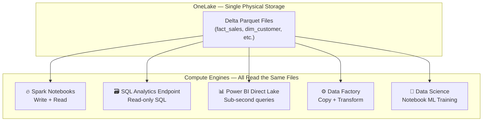
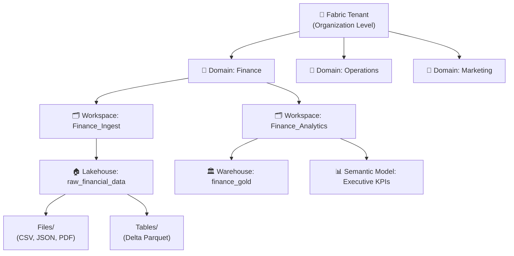
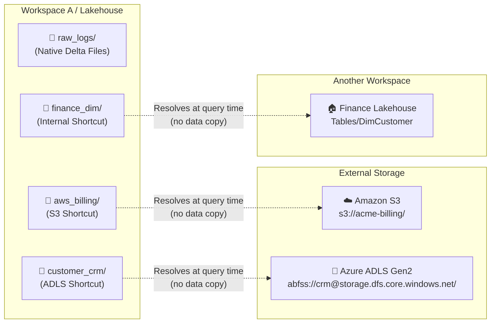
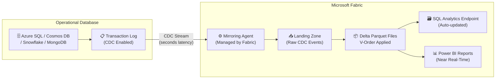
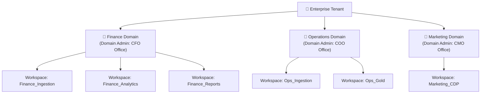
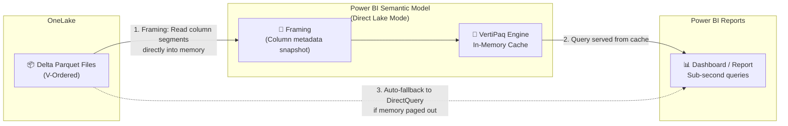
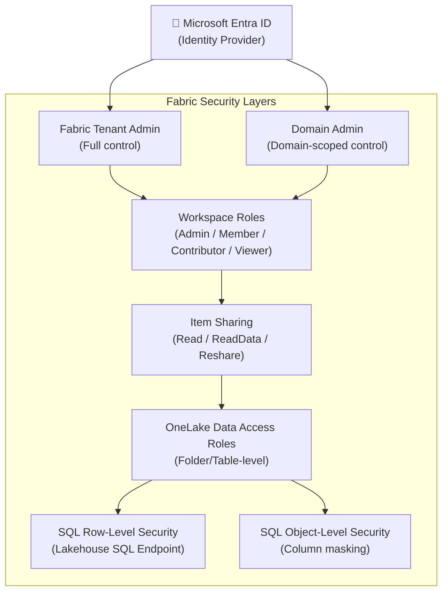
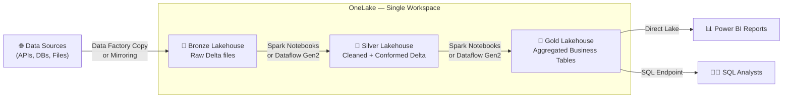

# OneLake Explained: The Complete Microsoft Fabric OneLake Architecture Guide (2026 Edition)

## Executive Summary

Microsoft Fabric represents the most significant shift in Microsoft's data platform strategy since the launch of Azure Synapse Analytics. At the absolute core of this SaaS analytics platform is **OneLake** — a single, unified, logical data lake for the entire organization that fundamentally changes how enterprises store, access, and govern data at scale.

Just as Microsoft OneDrive provides a single storage location for all office documents regardless of which device or application created them, OneLake acts as the single repository for all enterprise data — eliminating silos, preventing data duplication, and collapsing the governance fragmentation that defined the previous decade of cloud analytics architectures.

This guide is the most comprehensive technical reference to OneLake available. Whether you are a data engineer designing your first Microsoft Fabric architecture, an analytics engineer preparing for the DP-600 or DP-700 certifications, a solution architect migrating from Azure Synapse or Databricks, or a data platform leader evaluating Microsoft Fabric for enterprise adoption — this guide covers every technical layer of OneLake in depth.

---

## Key Takeaways

1. **Single Logical Tenant**: OneLake is provisioned automatically with every Microsoft Fabric tenant. There is only one OneLake per tenant, and all workspaces within that tenant share this unified logical namespace.
2. **Open Storage Standards**: OneLake stores all tabular data in **Delta Lake (Parquet)** format. This open format ensures any compute engine — Fabric Spark, SQL, Power BI, even external Databricks — can read data without format conversion or ETL.
3. **The OneCopy Principle**: Data stored in OneLake exists as a single physical copy. Multiple compute engines read from the same Delta files simultaneously — there is no Import Mode copy, no warehouse copy, no reporting layer copy.
4. **V-Order Serialization**: Microsoft applies a proprietary write-optimization called **V-Order** to Parquet files in OneLake, enabling sub-second Direct Lake query performance in Power BI without data movement.
5. **Data Virtualization via Shortcuts**: Shortcuts allow OneLake to reference data in other workspaces, Azure Data Lake Storage Gen2, Amazon S3, or Google Cloud Storage without moving or duplicating the underlying files.
6. **Zero-ETL Mirroring**: Mirroring continuously replicates operational databases (Azure SQL, Cosmos DB, Snowflake, MongoDB) directly into OneLake in Delta format using Change Data Capture — with no ETL pipelines required.
7. **Direct Lake Mode**: Power BI Semantic Models query OneLake Delta tables directly without importing data into VertiPaq memory or running live DirectQuery, combining the speed of Import with the freshness of DirectQuery.

---

## 1. Why Microsoft Built OneLake: The Vision and History

### The Problem Microsoft Was Solving

Between 2015 and 2023, enterprises building cloud analytics platforms on Azure assembled complex stacks: Azure Data Factory for ingestion, Azure Data Lake Storage Gen2 for raw storage, Azure Synapse Analytics or Databricks for transformation, Azure Analysis Services or Power BI Premium for reporting. Each service was excellent in isolation. Together, they created extraordinary operational complexity:

- **Data was copied 3-4 times**: Raw → Bronze Lake → Silver Warehouse → Gold Power BI Import Model.
- **ETL pipelines consumed 60% of engineering time**: Just keeping copies synchronized.
- **Security was fragmented**: ADLS ACLs, Synapse SQL RBAC, Power BI workspace roles — all configured independently.
- **Governance was impossible**: Data lineage could not span service boundaries without expensive third-party tooling.
- **Costs were unpredictable**: Storage and compute were billed independently across 6+ services.

Microsoft's engineering team spent three years solving this at the platform level, not at the application level. The result was **Microsoft Fabric**, launched in general availability in November 2023, with OneLake as its architectural foundation.

### The Architectural Philosophy

OneLake is not a feature of Microsoft Fabric. It is the foundation that makes Microsoft Fabric architecturally coherent. Every design decision in Fabric flows from three storage-layer commitments:

1. **One physical copy of data** — the OneCopy Principle.
2. **Open format for all tabular data** — Delta Lake on Parquet.
3. **SaaS-managed infrastructure** — no storage accounts, no firewall rules, no resource keys.

Without these three commitments, Fabric would be yet another analytics suite of loosely coupled services. With them, it becomes a coherent platform where a data engineer's Bronze table, an analytics engineer's Gold semantic model, and a data scientist's training dataset are the same physical bytes.

---

## 2. The OneCopy Principle: One Physical Copy, Many Engines

The single most important concept in OneLake architecture is the **OneCopy Principle**: data stored in OneLake exists as exactly one physical copy of files, readable by every authorized compute engine simultaneously.



### Before OneCopy: The Data Multiplication Problem

In a traditional architecture, the same `fact_sales` data existed in:
- ADLS Gen2 as raw CSV files (ingestion layer)
- Synapse dedicated SQL pool tables (warehouse layer)
- Power BI `.pbix` VertiPaq columnar model (reporting layer)

Three copies. Three pipeline jobs keeping them in sync. Three access control systems. Three places to apply data quality rules.

### After OneCopy: The Unified Storage Reality

In OneLake, `fact_sales` is a Delta Parquet table in the `Tables/` directory of a Lakehouse. That is the only copy. The SQL Analytics Endpoint reads it directly. Power BI Direct Lake loads its V-Ordered columns directly into VertiPaq memory. Spark notebooks read and write it using standard Delta APIs. A Data Factory pipeline can also read it. Every engine, same files.

---

## 3. OneLake Internal Architecture Deep Dive

### Physical Infrastructure

OneLake is built on top of **Azure Data Lake Storage Gen2** (ADLS Gen2). This means it inherits Azure's enterprise-grade storage characteristics: 99.9999999999% (12 nines) durability, geo-redundant replication options, 10Gbps+ throughput, and hierarchical namespace support for efficient file system operations.

However, OneLake completely abstracts the ADLS Gen2 infrastructure layer from the user. There are no storage accounts to provision, no SAS tokens to manage, no firewall rules to configure, no container endpoints to expose. Microsoft provisions, manages, and scales the underlying ADLS Gen2 infrastructure as part of the Fabric SaaS offering.

### The Logical Namespace Hierarchy



| Hierarchy Level | Description | Governance Scope |
|---|---|---|
| **Tenant** | One per organization. One OneLake per tenant. | Fabric Admin Portal |
| **Domain** | Logical grouping of workspaces by business unit | Domain Admin |
| **Workspace** | Collaborative project folder, assigned to a Capacity | Workspace Admin |
| **Item** | Lakehouse, Warehouse, Pipeline, Semantic Model, etc. | Item Owner |
| **Files/Tables** | Physical data within a Lakehouse | OneLake Data Access Roles |

### OneLake DFS Endpoint

OneLake exposes a standard ADLS Gen2-compatible DFS (Distributed File System) endpoint:

```text
https://onelake.dfs.fabric.microsoft.com/{workspace}/{item}.Lakehouse/Tables/{table}/
```

This means any tool that understands ADLS Gen2 — Azure Storage Explorer, Spark, azcopy, the Azure SDK — can read from and write to OneLake using the same code that previously targeted ADLS Gen2 storage accounts. This dramatically simplifies migrations.

---

## 4. OneLake vs Azure Data Lake Storage Gen2: Detailed Comparison

| Dimension | OneLake | ADLS Gen2 |
|---|---|---|
| **Provisioning** | Automatic with Fabric tenant | Manual storage account creation |
| **Authentication** | Microsoft Entra ID (OAuth 2.0) | Entra ID, SAS tokens, storage keys |
| **Namespace** | Hierarchical (tenant/workspace/item) | Container-based (account/container/path) |
| **Storage Format** | Delta Lake enforced for tables | Any format (no enforcement) |
| **Multi-engine Access** | Native (Spark, SQL, Power BI share files) | Requires separate configuration per engine |
| **Governance** | Fabric roles + Purview (unified) | ADLS ACLs + separate Purview policy |
| **Shortcuts** | Built-in (can point to ADLS Gen2) | Not applicable |
| **Mirroring** | Built-in CDC replication | Not applicable |
| **V-Order** | Applied automatically by Fabric engines | Not applied |
| **Cost Model** | Bundled in Fabric capacity + storage rate | Separate storage account billing |
| **Firewall** | Managed by Microsoft | User-configured per account |
| **Region** | Co-located with Fabric capacity | User-selected |

---

## 5. Delta Lake Foundations: The Storage Engine of OneLake

### Why Delta Lake?

OneLake mandates **Delta Lake** as the table format for all tabular data. Delta Lake is an open-source storage layer created by Databricks and donated to the Linux Foundation. OneLake's adoption of Delta Lake is one of Microsoft's most strategically significant decisions — it ensures that data written by a Microsoft Fabric Lakehouse is directly readable by Databricks, open-source Spark, DuckDB, Polars, and any other Delta-aware compute engine without an export step.

### Delta Lake Physical Structure

Every Delta table in OneLake consists of exactly two components:

```text
fact_sales/
├── _delta_log/
│   ├── 00000000000000000000.json    ← Commit 0: CREATE TABLE
│   ├── 00000000000000000001.json    ← Commit 1: INSERT (Append)
│   ├── 00000000000000000002.json    ← Commit 2: UPDATE
│   └── 00000000000000000010.checkpoint.parquet  ← Checkpoint (every 10 commits)
├── part-00000-abc123.c000.snappy.parquet   ← Data file 1
├── part-00001-def456.c000.snappy.parquet   ← Data file 2
└── part-00002-ghi789.c000.snappy.parquet   ← Data file 3
```

**The transaction log** (`_delta_log/`) is what makes Delta Lake more than just Parquet files. Every insert, update, delete, schema change, or partition operation is atomically recorded as a JSON commit entry. The checkpoint file, created every 10 commits by default, compacts the log for faster reads.

### ACID Guarantees in OneLake

| ACID Property | Delta Lake Implementation |
|---|---|
| **Atomicity** | A transaction either commits fully (all files listed in the log entry) or not at all |
| **Consistency** | Schema enforcement rejects writes that violate the table's declared schema |
| **Isolation** | Snapshot isolation allows concurrent reads while writes are in progress |
| **Durability** | Committed transactions are permanent; Azure's ADLS Gen2 provides geo-redundant backup |

### Time Travel

Delta's transaction log enables **time travel queries** — querying the table as it existed at a previous point in time or at a specific version number:

```text
SELECT * FROM fact_sales VERSION AS OF 5;
SELECT * FROM fact_sales TIMESTAMP AS OF '2026-06-01';
```

This is invaluable for auditing, recovering from accidental deletes, and debugging pipeline failures.

### Parquet: The Column-Oriented Format

Delta Lake stores data in **Apache Parquet** files. Parquet is a column-oriented storage format, meaning that values from the same column are stored physically adjacent on disk. This layout has profound performance implications for analytical queries:

- **Column pruning**: A `SELECT SalesAmount, Region` query only reads two columns from disk, even if the table has 200 columns.
- **Predicate pushdown**: A `WHERE Region = 'APAC'` filter is evaluated at the Parquet reader level using min/max statistics stored in row group metadata, skipping entire row groups that cannot contain matching rows.
- **Compression efficiency**: Columnar data compresses far more effectively than row data because similar values are grouped together (e.g., a `Status` column with 3 distinct values across 100M rows compresses to near-zero).

---

## 6. V-Order: Microsoft's Proprietary Write Optimization Engine

### What V-Order Does

**V-Order** is a proprietary write optimization that Microsoft applies to Parquet files written to OneLake by any Fabric compute engine (Spark, Data Factory Copy, Dataflow Gen2, Warehouse). V-Order is a post-compression, pre-write sorting and encoding step that reorganizes the internal layout of each Parquet row group to match the memory model expected by the **Power BI VertiPaq engine**.

Specifically, V-Order applies:
1. **Vertical (columnar) sorting** within each row group to increase value locality.
2. **Microsoft-proprietary compression** on top of standard Parquet encodings (dictionary, RLE, delta).
3. **Optimized dictionary ordering** to improve encoding ratios for low-cardinality columns.

### Why V-Order Matters for Direct Lake

When Power BI opens a Direct Lake semantic model, the VertiPaq engine reads column data directly from OneLake Parquet files into its in-memory cache. With standard Parquet files, VertiPaq must decode and re-encode column data to match its internal memory format — a CPU-intensive step.

With V-Ordered Parquet files, the on-disk layout is already aligned with VertiPaq's memory model. The engine reads and loads column segments in a single pass without transformation overhead, achieving:

- **Sub-second query performance** on tables with billions of rows.
- **Reduced memory pressure** during initial column loading.
- **Faster cold-start** times when a report first loads.

### Enabling and Verifying V-Order

V-Order is enabled by default in all Fabric Spark runtimes. You can verify it is enabled:

```text
spark.conf.get("spark.sql.parquet.vorder.enabled")
// Expected: "true"
```

To explicitly enable it in a Spark session:

```text
spark.conf.set("spark.sql.parquet.vorder.enabled", "true")
```

> **Note**: V-Order adds 5-15% overhead during the write operation. This is a deliberate trade-off — you pay a small write cost once to gain significant read performance improvements for every subsequent query.

---

## 7. OneLake Shortcuts: Data Virtualization Architecture

### What a Shortcut Is

A **Shortcut** is a logical pointer stored in OneLake's metadata that makes external data appear as native OneLake content. When you create a shortcut, OneLake does not copy any files. It stores only the target path, the credential reference, and the mount location. At query time, OneLake resolves the shortcut transparently.



### Types of Shortcuts

| Shortcut Type | Source | Use Case |
|---|---|---|
| **Internal** | Another Fabric workspace | Share Gold tables between departments without data duplication |
| **ADLS Gen2** | Azure Data Lake Storage Gen2 | Migrate existing ADLS investments step-by-step; keep existing pipelines running |
| **Amazon S3** | AWS S3 (and S3-compatible: MinIO, Cloudflare R2) | Multi-cloud data access; connect existing AWS data lake |
| **Google Cloud Storage** | GCS buckets | Cross-cloud analytics without data movement |
| **Dataverse** | Microsoft Dataverse tables | Connect Power Platform and Fabric without exports |

### Shortcut Resolution at Runtime

When a Spark job or SQL query accesses a shortcut path:

1. The compute engine sends a file list request to the OneLake DFS endpoint.
2. OneLake's metadata service detects the path is a shortcut.
3. OneLake retrieves the credentials stored in Fabric's secure credential store (managed identities or service principal certificates).
4. OneLake generates a scoped, short-lived access token for the target storage.
5. The compute engine's storage driver accesses the target (S3, ADLS, etc.) directly, streaming data blocks to its compute nodes.

The query engine sees no difference between native OneLake files and shortcut-mounted files. Both appear under the same DFS namespace.

### Performance Considerations for Shortcuts

- **Same Azure region**: Network latency is negligible (< 1ms). Performance is nearly identical to native OneLake tables.
- **Cross-Azure region**: Expect 5-20ms additional latency per request. For large analytical scans, this adds up. Consider caching or replication.
- **Cross-cloud (S3, GCS)**: Network egress costs apply from the source cloud. Cross-cloud latency can be 20-100ms per request. For frequently queried data, mirroring is preferable over shortcuts.
- **Shortcut to Delta tables**: Full Delta features (time travel, ACID) work when the shortcut targets a Delta table. Non-Delta files (CSV, Parquet without Delta log) are accessible but lack transaction guarantees.

---

## 8. Mirroring: Zero-ETL Real-Time Database Replication

### The Problem Mirroring Solves

Every enterprise has operational databases (Azure SQL, Azure Cosmos DB, Snowflake, MySQL, MongoDB) that contain the freshest transactional data. Getting that data into a data lake for analytics traditionally required building and maintaining complex ETL pipelines — scheduled extracts, change detection logic, upsert handling, error recovery.

Mirroring eliminates this entire layer. It connects directly to the database's transaction log and streams changes into OneLake continuously, with latency measured in seconds.



### Supported Mirroring Sources (2026)

| Source | CDC Mechanism | Latency | Full/Incremental |
|---|---|---|---|
| Azure SQL Database | SQL Server CDC (log-based) | < 30 seconds | Both |
| Azure Cosmos DB (NoSQL) | Change Feed | < 60 seconds | Both |
| Snowflake | Snowflake Streams | < 5 minutes | Incremental |
| MongoDB Atlas | Change Streams | < 60 seconds | Incremental |
| Azure SQL Managed Instance | SQL Server CDC | < 30 seconds | Both |
| Azure Database for PostgreSQL | Logical Replication | < 60 seconds | Incremental |

### How Mirroring Works — Technical Detail

1. **CDC Activation**: Fabric enables Change Data Capture on the source database's transaction log or uses a native streaming API (Cosmos Change Feed, Mongo Change Streams).
2. **Event Capture**: The Mirroring Agent (a managed Fabric service, not a customer-deployed component) reads uncommitted change events from the log in real time.
3. **Serialization**: Each CDC event (INSERT, UPDATE, DELETE) is serialized into a Parquet row with metadata columns: `_change_type`, `_commit_version`, `_commit_timestamp`.
4. **V-Order + Delta Commit**: The agent applies V-Order and writes the changes as Delta table commit entries in the Mirrored Database item in OneLake.
5. **SQL Endpoint Auto-update**: The SQL Analytics Endpoint's metadata cache is invalidated, making the new rows immediately queryable via T-SQL.
6. **Merge Logic**: The Mirroring engine periodically runs a MERGE operation to apply updates and deletes to the base table, compacting the Delta log.

### Mirroring vs Shortcuts: When to Use Which

| Scenario | Use Shortcut | Use Mirroring |
|---|---|---|
| Source is a file store (ADLS, S3, GCS) | ✅ | ❌ |
| Source is a transactional database | ❌ | ✅ |
| Need near real-time freshness | ❌ | ✅ |
| Source data rarely changes | ✅ | ❌ (wasteful) |
| Need full ACID table in OneLake | ❌ | ✅ |
| Need to avoid database load | ✅ | ✅ (log-based, minimal impact) |

---

## 9. Domains and Workspace Hierarchy: Organizing at Scale

### Why Domains Exist

A large enterprise can have hundreds or thousands of Fabric workspaces. Without organizational structure, OneLake becomes a flat namespace that is difficult to govern, navigate, and delegate. **Domains** provide a hierarchical grouping layer above workspaces that maps to business units, regions, or data mesh design patterns.

### Domains in Practice



### Domain Governance Features

- **Domain-scoped Admin roles**: Domain Admins can manage all workspaces within their domain without having Fabric Tenant Admin rights.
- **Domain-level default sensitivity labels**: All workspaces in a domain can inherit a sensitivity label policy.
- **Cross-domain shortcuts**: A Marketing workspace can create an Internal Shortcut to a Finance Gold table without either domain admin needing to create a new workspace.
- **Domain metadata in Purview**: Microsoft Purview displays data assets organized by domain for catalog browsing and lineage.

---

## 10. Lakehouse Storage: Files and Tables

### The Lakehouse as a Storage Item

A **Fabric Lakehouse** is the primary storage item for data engineering workloads. It exposes two distinct storage zones within OneLake:

```text
my_lakehouse.Lakehouse/
├── Files/          ← Unstructured or semi-structured data (any format)
│   ├── raw_uploads/
│   │   ├── 2026-07-15_transactions.csv
│   │   └── sensor_data.json
│   └── notebooks/
│       └── analysis.ipynb
└── Tables/         ← Managed Delta Lake tables (enforced by Fabric)
    ├── fact_sales/
    │   ├── _delta_log/
    │   └── *.parquet
    └── dim_customer/
        ├── _delta_log/
        └── *.parquet
```

### Files Directory

The `Files/` directory accepts any format — CSV, JSON, Parquet, AVRO, ORC, XML, PDF, images, binaries. This is the raw ingestion zone. There are no schema enforcement constraints. A Data Factory pipeline can write raw API responses as JSON files here. A Python notebook can write model artifacts as pickle files here. Spark can read any of these formats directly.

### Tables Directory

The `Tables/` directory is schema-enforced. Every table stored here must be in Delta Lake format. When a Spark notebook writes a Delta table to `Tables/`, the SQL Analytics Endpoint automatically discovers and registers it as a readable SQL view — without any manual schema registration.

This auto-discovery is a powerful feature. Data engineers write tables via Spark; SQL analysts immediately query them via T-SQL through the endpoint, with no intermediary step.

### SQL Analytics Endpoint

Every Lakehouse automatically provisions a **SQL Analytics Endpoint** — a read-only SQL serverless compute layer that translates T-SQL queries into Parquet file reads against the Lakehouse's `Tables/` directory. The endpoint is a serverless compute surface; there is no SQL pool to manage, no index to build, no statistics to update manually.

This means a data analyst who only knows T-SQL can run queries like `SELECT TOP 100 * FROM fact_sales WHERE region = 'APAC'` against Delta files that were written by a data engineer using PySpark — without either party needing to know how the other works.

---

## 11. Data Warehouse Storage in OneLake

### How Fabric Warehouse Stores Data

Unlike the Lakehouse, where tables are created via Spark or file uploads, the **Fabric Data Warehouse** is a fully managed T-SQL engine where tables are created using standard DDL:

```text
CREATE TABLE dbo.fact_sales (
    SaleID INT,
    CustomerID INT,
    SalesAmount DECIMAL(18,2),
    SaleDate DATE
);
```

Despite this SQL-first interface, the Fabric Data Warehouse does **not** store data in proprietary SQL Server database files (`.mdf`, `.ndf`). Every table in the Fabric Data Warehouse is stored as Delta Parquet files in OneLake, under the warehouse's folder in the workspace.

This architectural decision has a profound consequence: **Warehouse tables are readable by Spark and Power BI Direct Lake without any export step**. The Lakehouse and Warehouse are the same physical storage layer viewed through different compute interfaces.

### Lakehouse vs Warehouse: Decision Framework

| Consideration | Choose Lakehouse | Choose Warehouse |
|---|---|---|
| Primary users | Data engineers, data scientists | SQL analysts, DBAs |
| Primary interface | Spark notebooks, Python | T-SQL, SQL views |
| Table creation method | Spark WRITE, Delta API | T-SQL CREATE TABLE |
| Schema enforcement | Flexible (schema-on-read for Files/) | Strict (schema-on-write) |
| Streaming workloads | ✅ Spark Structured Streaming | ❌ |
| Complex SQL transactions | Limited | ✅ Full T-SQL ACID |
| Cross-database queries | Shortcut-based | ✅ Native via three-part naming |
| Power BI Direct Lake | ✅ | ✅ |

---

## 12. Semantic Models and Direct Lake: Query Flow Architecture

### The Three Power BI Query Modes

Before Direct Lake, Power BI had two query modes:

- **Import Mode**: Data is extracted from the source and loaded into VertiPaq's in-memory compressed columnar store. Queries are extremely fast. But data goes stale between refreshes, and refresh jobs consume compute and time.
- **DirectQuery Mode**: Every report interaction fires a live SQL query to the source database. Data is always fresh. But query latency is high (seconds per visual), and the source database takes the query load.

**Direct Lake** is the third mode, only available for OneLake Delta tables. It combines the best of both:



### How Direct Lake Works — Step by Step

1. **Framing**: When a Direct Lake semantic model is opened or refreshed, the VertiPaq engine executes a **framing** operation — it reads the Delta table's transaction log to determine the current set of Parquet files and their column segment metadata.
2. **Column Loading**: VertiPaq reads V-Ordered Parquet column segments directly from OneLake into its memory cache. Because V-Order aligns the on-disk layout with VertiPaq's internal format, this is a near-zero-transformation read.
3. **Query Serving**: All DAX queries and report interactions are served from the VertiPaq in-memory cache. Performance is equivalent to Import Mode.
4. **Automatic Freshness**: When new data is committed to the Delta table, the semantic model automatically detects the new transaction log entry on the next query, re-frames to include new data, and loads new column segments. **There is no manual refresh button**.
5. **Fallback**: If the Fabric capacity's available memory is exhausted, Direct Lake automatically falls back to DirectQuery mode, issuing live SQL queries to the SQL Analytics Endpoint. This maintains query correctness at the cost of latency.

### Direct Lake Paging Limits by Capacity SKU

| Capacity SKU | Max Direct Lake Table Rows | Memory per Query |
|---|---|---|
| F2 / F4 | ~300M rows | Limited |
| F8 | ~1B rows | 3 GB |
| F16 | ~3B rows | 5 GB |
| F32 | ~6B rows | 10 GB |
| F64+ | Unlimited (Enterprise) | 25 GB+ |

---

## 13. Data Factory Integration with OneLake

### Data Factory in the Fabric Context

**Data Factory** in Microsoft Fabric is the orchestration and ingestion engine. Unlike standalone Azure Data Factory (which writes to ADLS Gen2 accounts), Fabric Data Factory writes directly to OneLake items using the same Delta format.

Key integration patterns:

- **Copy Activity → Lakehouse**: Copy data from any of 90+ supported connectors (Salesforce, REST API, SAP, Oracle) directly into a Lakehouse `Files/` or `Tables/` directory.
- **Dataflow Gen2 → Delta Table**: Transform data with Power Query M expressions and output directly as Delta tables in a Lakehouse.
- **Pipeline → Spark Notebook**: Orchestrate PySpark transformation notebooks that read from and write to OneLake.
- **Pipeline → Warehouse T-SQL**: Execute stored procedures in a Fabric Warehouse as part of a pipeline.

All Data Factory outputs go directly to OneLake. There is no intermediate ADLS Gen2 account to manage.

---

## 14. Eventhouse and Eventstream: Real-Time Intelligence in OneLake

### Eventstream

**Eventstream** is the real-time ingestion layer in Fabric. It connects to event sources (Azure Event Hubs, Apache Kafka, IoT Hub, Custom endpoints) and routes streaming data to destinations within Fabric.

Eventstream can route data to:
- **Eventhouse (KQL Database)**: For real-time analytics with Kusto Query Language.
- **Lakehouse**: Streaming data written as Delta files in the Lakehouse `Tables/` directory via Spark Structured Streaming.
- **Reflex (Fabric data activator)**: For real-time alerts and automated actions.

### Eventhouse (KQL Database)

An **Eventhouse** is a time-series and log analytics database optimized for high-throughput, low-latency queries on streaming data (IoT telemetry, application logs, clickstream, financial ticks). It uses the **Kusto Query Language (KQL)** — a read-optimized, LINQ-inspired query language purpose-built for time-series exploration.

Eventhouse data is stored in its own columnar format inside OneLake, within the Eventhouse item's folder in the workspace. A **KQL Database Shortcut** can expose Eventhouse tables to Lakehouse queries, enabling joins between historical Delta data and real-time KQL data.

---

## 15. Notebook Storage in OneLake

### Where Notebook Artifacts Live

Fabric Notebooks are Jupyter-compatible `.ipynb` files. When saved, they are stored in the workspace's OneLake folder as item metadata. The actual notebook code and output cells are stored in OneLake under the notebook item's path.

### Where Notebook Outputs Live

Notebook outputs — Spark-written Delta tables, exported files, ML model artifacts — are written to the target Lakehouse configured in the notebook's session. A notebook session with a default Lakehouse writes to `Tables/` or `Files/` in that Lakehouse's OneLake path.

```text
# Reading from OneLake in a Spark Notebook
df = spark.read.format("delta").load("Tables/fact_sales")

# Writing a transformed table back to OneLake
df_gold.write.format("delta").mode("overwrite").saveAsTable("gold_fact_sales")
```

### ML Model Storage

Machine learning models trained in Fabric Notebooks are saved to **MLflow experiments** stored in OneLake. Model artifacts (weights, parameters, metrics) are persisted in the OneLake path associated with the MLflow experiment item in the workspace, making them accessible to other Fabric items for inference pipelines.

---

## 16. OneLake Security Architecture



### Workspace Roles

| Role | Create Items | Write Data | Share Items | Manage Permissions |
|---|---|---|---|---|
| **Admin** | ✅ | ✅ | ✅ | ✅ |
| **Member** | ✅ | ✅ | ✅ | ❌ |
| **Contributor** | ✅ | ✅ | ❌ | ❌ |
| **Viewer** | ❌ | ❌ | ❌ | ❌ |

### OneLake Data Access Roles (Preview)

OneLake Data Access Roles allow data architects to define read permissions on specific **sub-folders** or **Delta tables** within a Lakehouse. A user assigned to a role sees only the tables and folders specified in that role's policy — even if they have Viewer access to the workspace.

This enables **column-safe sharing within a Lakehouse**: a Finance Lakehouse can contain both `fact_sales_detailed` (restricted to Finance Analysts) and `fact_sales_summary` (accessible to all Business Analysts), without splitting them into separate Lakehouses.

### SQL Row-Level Security (RLS)

The SQL Analytics Endpoint supports T-SQL Row-Level Security predicates that filter rows based on the querying user's identity:

```text
CREATE SECURITY POLICY RegionFilter
ADD FILTER PREDICATE dbo.fn_securitypredicate(Region)
ON dbo.fact_sales WITH (STATE = ON);
```

A user from the APAC team sees only APAC rows; a user from EMEA sees only EMEA rows — transparently, without application-level filtering.

---

## 17. Microsoft Purview Integration and Governance

### Purview as the Governance Layer

**Microsoft Purview** is the unified data governance platform for OneLake. Every Fabric item (Lakehouse, Warehouse, Pipeline, Semantic Model) automatically registers itself in Purview's Data Catalog when Fabric-Purview integration is enabled.

### Sensitivity Labels

Sensitivity labels (from Microsoft Information Protection) can be applied to:
- **Workspaces** (all items inherit the label)
- **Individual Lakehouses, Warehouses, Semantic Models**
- **Individual Delta tables** (via Purview's data map)

When a user exports data from a labeled item — downloading a CSV from a Power BI report, copying data to Excel — the sensitivity label travels with the export and enforces encryption, watermarking, or copy restrictions based on enterprise policy.

**Label Inheritance**: A Gold Delta table labeled "Confidential — Finance" automatically propagates that label to any Semantic Model built on top of it and any reports consuming that model.

### Data Lineage in Purview

Purview tracks lineage end-to-end across OneLake:

```text
Azure SQL DB → [Mirroring] → OneLake Lakehouse (Bronze) →
[Spark Notebook] → OneLake Lakehouse (Gold) →
[Direct Lake] → Semantic Model →
[Power BI] → Executive Dashboard
```

This lineage graph is invaluable for impact analysis: "If I change the schema of `fact_sales`, which downstream dashboards will break?"

---

## 18. RBAC, RLS, and OLS — Security Best Practices

### Layered Security Model

Microsoft recommends a **layered security approach** for OneLake:

1. **Layer 1 — Workspace Roles**: Coarse-grained access control. Use Workspace Roles to control who can create and manage items.
2. **Layer 2 — Item Sharing**: Grant non-workspace-members access to specific items (a single Lakehouse or Semantic Model) without workspace access.
3. **Layer 3 — OneLake Data Access Roles**: Fine-grained table/folder-level access within a Lakehouse.
4. **Layer 4 — SQL RLS/OLS**: Row and column filtering for users querying via the SQL Analytics Endpoint or Semantic Models.

### Object-Level Security (OLS)

Object-Level Security allows you to hide specific columns from non-privileged users in a Semantic Model. For example, a `SalaryAmount` column can be hidden from all roles except HR Analysts, without removing it from the underlying Delta table:

```text
EVALUATE
CALCULATETABLE(
    SUMMARIZE(Employee, Employee[Name], Employee[Department])
)
-- SalaryAmount is invisible to this user due to OLS
```

---

## 19. CI/CD Considerations for OneLake

### Deployment Pipelines

Fabric's **Deployment Pipelines** enable promotion of workspace content through Dev → Test → Production environments. For OneLake-backed items:

- **Lakehouse schemas** can be version-controlled in Git.
- **Spark notebooks** are stored as `.py` or `.ipynb` files and pushed through the pipeline.
- **Delta table data** is not promoted through Deployment Pipelines (only schemas/definitions move, not data).

### Git Integration

Fabric workspaces support **Git integration** with Azure DevOps or GitHub. When enabled:
- Every Lakehouse table schema, notebook, pipeline, and semantic model definition is serialized to `.json` and `.py` files in the connected repository.
- Pull Requests enforce code review before changes reach production workspaces.
- Branching strategies (feature branches, release branches) work the same way as application code.

### Infrastructure as Code

Fabric items can be provisioned and configured using:
- **Fabric REST APIs**: Programmatically create Lakehouses, Warehouses, and Pipelines.
- **Terraform (Community Provider)**: Declare Fabric workspaces and capacity assignments as infrastructure-as-code.
- **Bicep / ARM Templates**: Deploy Fabric capacities and workspaces alongside other Azure resources.

---

## 20. Performance Tuning OneLake

### 1. File Size Optimization (OPTIMIZE)

Frequent small appends — streaming ingestion, hourly partitions, micro-batch pipelines — generate hundreds of small Parquet files per table. Reading a table with 10,000 small files is dramatically slower than reading one with 50 large files, because each file requires a separate metadata lookup and network round-trip.

Run `OPTIMIZE` regularly to compact small files into larger row groups (typically targeting 256MB–1GB per file):

```text
OPTIMIZE fact_sales WHERE SaleDate >= '2026-01-01'
```

### 2. VACUUM: Reclaiming Storage

Delta's time travel retains old Parquet files even after they have been superseded by updates. After 30 days, those old files consume significant storage. Run `VACUUM` to purge them:

```text
VACUUM fact_sales RETAIN 168 HOURS  -- Keep 7 days of history
```

### 3. Partition Pruning

Partition your large Delta tables by date or region columns to enable partition pruning — queries with date filters skip entire partitions without reading them:

```text
df.write.format("delta")
  .partitionBy("SaleYear", "SaleMonth")
  .saveAsTable("fact_sales_partitioned")
```

### 4. Z-Ordering

For high-cardinality filter columns that are not partition keys, apply **Z-Ordering** to colocate related values in the same Parquet row groups:

```text
OPTIMIZE fact_sales ZORDER BY (CustomerID, ProductID)
```

Z-Ordering improves data skipping for queries like `WHERE CustomerID = 12345`.

### 5. Liquid Clustering (Delta 3.0+)

**Liquid Clustering** is the successor to static partitioning and Z-Ordering, available in Fabric Spark Runtime 3.4+. It automatically reorganizes data based on declared cluster keys without requiring OPTIMIZE:

```text
CREATE TABLE fact_sales
CLUSTER BY (SaleYear, Region);
```

---

## 21. Cost Optimization for OneLake

### OneLake Storage Pricing

OneLake storage is billed at approximately **$0.023 per GB per month** — effectively the same rate as Azure Data Lake Storage Gen2. For most enterprises, OneLake storage cost is trivial compared to compute cost.

### Compute Cost Drivers

All compute in Fabric (Spark, SQL, Data Factory, Power BI refreshes) consumes **Capacity Units (CUs)** from the Fabric capacity assigned to the workspace. CU consumption is the primary cost lever.

| Optimization | Impact |
|---|---|
| Run OPTIMIZE to reduce small files | Reduces Spark and SQL scan time → fewer CUs |
| Partition large tables | Enables partition pruning → fewer files scanned → fewer CUs |
| Use Direct Lake over Import | Eliminates refresh CU consumption entirely |
| Use Shortcuts instead of copying data | Eliminates Data Factory copy CU cost |
| Schedule heavy Spark jobs off-peak | Smoothing (Fabric Capacity handles burst smoothing over 24-hour windows) |
| Right-size Fabric SKU | Overpaying for unused CUs is common; monitor utilization in Capacity Metrics app |

### Fabric Capacity Metrics App

The **Microsoft Fabric Capacity Metrics App** (a Power BI template app) provides dashboards showing CU consumption by workspace, item type, and operation. Use this to identify the top 10 CU-consuming operations and optimize them first.

---

## 22. Enterprise Architecture Patterns

### Pattern 1: Medallion Architecture on OneLake

The most common Fabric pattern is the Medallion (Bronze/Silver/Gold) architecture implemented as multiple Lakehouses within a workspace:



### Pattern 2: Data Mesh with OneLake Domains

For large enterprises with multiple independent data teams, implement a Data Mesh pattern using Fabric Domains:

- Each business unit owns its own Domain and manages its own Ingest + Analytics workspaces.
- Cross-domain data sharing is achieved via **Internal Shortcuts** — the Marketing domain creates a shortcut to the Finance domain's `DimCustomer` table without physically copying it.
- An Executive Reporting workspace can shortcut to curated Gold tables from all domains, presenting a unified view without centralized ETL.

### Pattern 3: Medallion + Hub-and-Spoke for Multi-tenant Analytics

For ISVs or enterprises with multiple subsidiaries:
- A **Hub Lakehouse** contains enterprise-wide master data (Dimensions, Reference tables).
- Spoke Lakehouses for each subsidiary or tenant shortcut to the Hub for shared dimensions.
- Spoke workloads can proceed independently without Hub team involvement.

---

## 23. OneLake Best Practices Checklist

### Folder and Naming Organization

- [ ] Use consistent lowercase snake_case for table names (`fact_sales`, `dim_customer`)
- [ ] Prefix Bronze/Silver/Gold tables with layer indicator if in one Lakehouse (`bronze_raw_orders`, `gold_sales_summary`)
- [ ] Never store sensitive PII data in `Files/` without a sensitivity label on the Lakehouse
- [ ] Use managed tables (`Tables/`) for all analytical data; use `Files/` only for raw staging

### Workspace Organization

- [ ] One workspace per environment (Dev, Test, Production)
- [ ] Assign workspaces to appropriate Fabric capacities (Prod → large SKU, Dev → small SKU)
- [ ] Use Domains to group workspaces by business unit
- [ ] Enable Git integration for all production workspaces
- [ ] Document workspace purpose and owner in the workspace description

### Capacity Planning

- [ ] Start with F8 for development environments
- [ ] Use F64+ for production workloads with Direct Lake on large semantic models
- [ ] Monitor CU utilization in the Capacity Metrics App weekly
- [ ] Enable Autoscale (Fabric Trial or Pay-as-you-go) for burst workloads
- [ ] Schedule heavy batch Spark jobs during off-peak hours to avoid CU throttling

### Security Boundaries

- [ ] Never grant workspace Admin role to service accounts; use Member or Contributor
- [ ] Use OneLake Data Access Roles for table-level security within shared Lakehouses
- [ ] Apply sensitivity labels at the workspace level for consistent inheritance
- [ ] Enable Purview lineage scanning for all production workspaces
- [ ] Audit workspace membership quarterly

### Data Quality

- [ ] Enable Delta constraints (NOT NULL, CHECK) for critical business key columns
- [ ] Run OPTIMIZE weekly on tables with high write frequency
- [ ] Run VACUUM with 168-hour retention on tables where time travel is not required
- [ ] Monitor Delta table health using `DESCRIBE DETAIL` and `DESCRIBE HISTORY`

---

## 24. OneLake Decision Matrix

| Scenario | Recommended Approach |
|---|---|
| Migrating from ADLS Gen2 with existing pipelines | ADLS Gen2 Shortcut → Gradually migrate to native Lakehouse tables |
| Multi-team analytics, shared dimensions | Internal Shortcuts from team workspaces to central DimHub |
| Large enterprise with 10+ business units | Fabric Domains + Workspace separation per business unit |
| Self-service BI with SQL analysts | Fabric Lakehouse + SQL Analytics Endpoint |
| Enterprise reporting with Power BI | Lakehouse or Warehouse → Semantic Model in Direct Lake mode |
| Near real-time analytics (< 1 minute latency) | Mirroring from operational DB → Direct Lake Semantic Model |
| IoT / clickstream telemetry | Eventstream → Eventhouse (KQL) + Lakehouse Shortcut |
| ML model training | Lakehouse Files/ for raw data → Lakehouse Tables/ for feature store |
| Regulatory compliance with data sovereignty | Domain + Workspace per region, capacity in sovereign region |
| Replacing Databricks | Fabric Lakehouse (Spark) + Unity Catalog Shortcut during transition |

---

## 25. OneLake Feature Comparison: vs. Cloud Storage Alternatives

| Feature | OneLake | ADLS Gen2 | Amazon S3 | Google Cloud Storage | Databricks Unity Catalog |
|---|---|---|---|---|---|
| **Managed service** | ✅ Full SaaS | Partial (IaaS) | Partial (IaaS) | Partial (IaaS) | Partial |
| **Delta Lake native** | ✅ | Optional | Optional | Optional | ✅ |
| **V-Order optimization** | ✅ | ❌ | ❌ | ❌ | ❌ |
| **Direct Lake Power BI** | ✅ | ❌ | ❌ | ❌ | ❌ |
| **Built-in SQL endpoint** | ✅ | ❌ | ❌ | ❌ | ✅ (Delta Sharing) |
| **Zero-ETL Mirroring** | ✅ | ❌ | ❌ | ❌ | ❌ |
| **Shortcuts (virtual mount)** | ✅ | ❌ | ❌ | ❌ | Delta Sharing |
| **Purview governance** | ✅ Native | ✅ via connector | Via connector | Via connector | Via connector |
| **Pricing model** | CU + Storage | Storage + transactions | Storage + requests | Storage + requests | DBU + Storage |
| **Multi-cloud access** | Via Shortcuts | ❌ | ❌ | ❌ | Via Delta Sharing |

---

## 26. Common Mistakes in OneLake Architecture

### Mistake 1: Creating Separate Workspaces Instead of Using Shortcuts

**Problem**: Teams create separate workspaces and copy shared dimension tables between them manually.
**Fix**: Use Internal Shortcuts to share Gold tables across workspaces. One source of truth, zero duplication.

### Mistake 2: Using Files/ Instead of Tables/ for Analytical Data

**Problem**: Data engineers write Parquet files to `Files/` without a Delta log. Power BI cannot query these with Direct Lake; the SQL Endpoint cannot auto-discover them.
**Fix**: Always write analytical tables to `Tables/` using Delta format. Use `Files/` only for raw staging.

### Mistake 3: Skipping OPTIMIZE on High-Write Tables

**Problem**: Streaming or hourly-batch tables accumulate thousands of small Parquet files. Query performance degrades over weeks.
**Fix**: Schedule a weekly OPTIMIZE job on all high-write tables using a Fabric Pipeline.

### Mistake 4: Not Enabling V-Order in Legacy Spark Code

**Problem**: Teams migrating existing Spark code from Databricks disable V-Order to match the Databricks behavior, breaking Direct Lake performance.
**Fix**: Always verify `spark.sql.parquet.vorder.enabled` is `true` in Fabric Spark sessions. Never disable it unless testing.

### Mistake 5: Assigning All Workspaces to a Single Large Capacity

**Problem**: Dev, Test, and Production workspaces share one capacity. A heavy dev Spark job throttles production Power BI reports.
**Fix**: Use separate capacity SKUs for Dev/Test (F4-F8) and Production (F64+).

### Mistake 6: Using Mirroring for Static Reference Data

**Problem**: Teams enable Mirroring for tables that rarely change, consuming continuous CU compute unnecessarily.
**Fix**: Use a scheduled Data Factory pipeline for low-change reference data. Reserve Mirroring for tables with frequent transactional changes.

---

## 27. Migration Guides

### Migrating from ADLS Gen2 to OneLake

**Phase 1 — Zero-downtime bridge (Weeks 1-4)**:
1. Create an ADLS Gen2 Shortcut in a Fabric Lakehouse pointing to your existing ADLS Gen2 storage account containers.
2. Update Power BI and SQL analytics tools to point to the Lakehouse SQL Endpoint (which serves the shortcut data).
3. Existing ADLS pipelines continue writing to ADLS Gen2. No changes required.

**Phase 2 — Migrate pipelines (Months 2-3)**:
1. Repoint Data Factory pipelines to write directly to Lakehouse `Tables/` instead of ADLS Gen2.
2. Verify Delta writes land in `Tables/` with V-Order enabled.
3. Remove ADLS Gen2 shortcuts as native tables are available.

**Phase 3 — Decommission ADLS Gen2 (Month 4+)**:
1. Delete shortcuts. Remove ADLS Gen2 storage accounts.
2. Apply OneLake Data Access Roles to replace ADLS ACLs.

### Migrating from Azure Synapse Analytics

| Synapse Component | Fabric Equivalent | Migration Approach |
|---|---|---|
| Dedicated SQL Pool | Fabric Data Warehouse | Export data as Parquet → Import to Warehouse via COPY INTO |
| Serverless SQL Pool | Lakehouse SQL Endpoint | Create Shortcuts to existing ADLS; re-point queries |
| Spark Pool | Lakehouse + Notebooks | Migrate `.ipynb` notebooks; update storage paths |
| Synapse Pipelines | Fabric Data Factory | Recreate pipelines using Fabric's pipeline editor |
| Linked Services | Connections (Fabric) | Recreate in Fabric Connections hub |

### Migrating from Databricks

The Databricks-to-Fabric migration is significantly smoother than other migrations because both platforms use **Delta Lake on Parquet** as the table format:

1. **Storage**: If your Databricks Unity Catalog uses ADLS Gen2, create a Shortcut in a Fabric Lakehouse pointing to the Unity Catalog managed storage path. Delta tables are immediately readable.
2. **Notebooks**: Databricks PySpark notebooks run in Fabric Spark with minimal changes. The primary change is the storage path format.
3. **Unity Catalog → OneLake ACLs**: Map Unity Catalog grants to Fabric OneLake Data Access Roles and workspace roles.
4. **MLflow**: Fabric supports MLflow natively for experiment tracking; migrate MLflow experiment paths.

---

## 28. Troubleshooting Guide

### Shortcut Failures

**Symptoms**: Queries against a shortcut return `Path not found` or `Access denied`.

**Resolution**:
1. Verify the credential in the Fabric Connection Hub is valid and not expired.
2. Check that the service principal or managed identity has `Storage Blob Data Reader` on the target ADLS Gen2 account or S3 bucket policy.
3. Verify the target path still exists in the external storage.
4. For S3 shortcuts, ensure the S3 bucket policy allows the Fabric service principal's ARN.

### Direct Lake Fallback to DirectQuery

**Symptoms**: Power BI reports become slow; telemetry shows `DirectQuery` mode instead of `Direct Lake`.

**Resolution**:
1. Check if the semantic model's tables exceed the capacity SKU's memory limits.
2. Run `OPTIMIZE` on the underlying Delta tables to reduce file count.
3. Reduce the number of high-cardinality columns in the semantic model.
4. Upgrade the Fabric capacity SKU.
5. Set `DirectLakeBehavior = DirectLakeOnly` to surface errors rather than silently falling back.

### Delta Table Corruption

**Symptoms**: `DeltaTableOperationException: No snapshot found` or transaction log errors.

**Resolution**:
1. Run `DESCRIBE HISTORY table_name` to identify the last valid commit.
2. Restore the table to the last valid version: `RESTORE TABLE table_name TO VERSION AS OF <version>`.
3. Investigate the Spark job that caused the corrupted commit and fix the root cause.
4. Enable `delta.checkpointInterval = 10` (default) to maintain checkpoint files for faster recovery.

### Mirroring Latency Spikes

**Symptoms**: Mirrored tables fall significantly behind the source database (latency > 5 minutes).

**Resolution**:
1. Check source database CDC health: `SELECT * FROM sys.dm_cdc_log_scan_sessions`.
2. Verify there are no long-running transactions blocking log reads on the source.
3. Ensure the Fabric capacity has sufficient CUs for the Mirroring background agent.
4. Check for large schema changes on the source (ALTER TABLE) that trigger a full table resync.

### Workspace Access Issues

**Symptoms**: Users report `Access denied` when accessing Lakehouse items despite having workspace roles.

**Resolution**:
1. Verify the user's Entra ID group membership has propagated (can take up to 24 hours for large groups).
2. Check if OneLake Data Access Roles are configured and the user is not assigned to any role with access to the requested table.
3. Confirm the workspace is not in a capacity that is paused or suspended.

### Capacity Throttling

**Symptoms**: Jobs fail with `Capacity overloaded` or Power BI reports time out.

**Resolution**:
1. Open the Fabric Capacity Metrics App and identify the top CU-consuming operations.
2. Move heavy batch Spark jobs to off-peak hours.
3. Upgrade the capacity SKU, or split high-demand workspaces to a separate capacity.
4. Enable Fabric Burst and Smoothing (available for Pay-as-you-go capacities).

---

## 29. OneLake Future Roadmap

Microsoft's public Fabric roadmap (as of 2026) includes several OneLake-specific enhancements. The following items are either in preview or on the announced roadmap:

- **OneLake Catalog (GA)**: A unified metadata catalog embedded within Fabric, replacing the need for external Purview scanning for Fabric-native assets.
- **OneLake Data Access Roles (GA)**: Folder and table-level security is currently in Preview; GA is targeted for 2026.
- **Mirroring for PostgreSQL (GA)**: Logical replication-based mirroring for Azure Database for PostgreSQL.
- **Mirroring for MySQL**: Announced for preview.
- **OneLake External Data Sharing**: Share Delta tables from OneLake with external partners or other Fabric tenants without data movement (similar to Databricks Delta Sharing).
- **Liquid Clustering (GA)**: Auto-optimizing clustering for Delta tables without manual OPTIMIZE commands.
- **Fabric Workspace Git Integration — Branching Strategies**: Advanced Git branching (feature branches, pull request templates) for Fabric workspace items.
- **Vector Store in OneLake**: Native support for vector embeddings stored in OneLake for AI/RAG applications.

> **Note**: Roadmap items are subject to change. Always verify current feature availability in the official [Microsoft Fabric release notes](https://learn.microsoft.com/en-us/fabric/release-plan/).

---

## 30. Certification Tips: DP-600 and DP-700

### DP-600: Analytics Engineer (OneLake Focus Areas)

The [DP-600 study guide](/blog/dp-600-study-guide-2026) covers OneLake extensively. Key exam areas:

- **OneLake storage hierarchy**: Know the Tenant → Domain → Workspace → Item → Tables/Files hierarchy cold.
- **Direct Lake vs Import vs DirectQuery**: Understand when each mode is appropriate and what causes Direct Lake to fall back to DirectQuery.
- **Delta Lake table operations**: OPTIMIZE, VACUUM, RESTORE, DESCRIBE HISTORY, DESCRIBE DETAIL.
- **Shortcut types**: Know which credential type each shortcut type requires (Managed Identity, Service Principal, Account Key).
- **Workspace Roles**: Know exactly what each role (Admin, Member, Contributor, Viewer) can and cannot do.

### DP-700: Data Engineer (OneLake Focus Areas)

The DP-700 goes deeper into data engineering patterns on OneLake:

- **Medallion Architecture implementation**: How to design Bronze/Silver/Gold Lakehouses, partition strategies, schema evolution.
- **Spark notebook integration with OneLake**: Reading and writing Delta tables, configuring V-Order, using Spark Structured Streaming to OneLake.
- **Mirroring configuration**: Setting up CDC-based mirroring, monitoring mirroring health, handling schema changes.
- **Pipeline orchestration**: Building Data Factory pipelines that orchestrate Lakehouse writes, transformations, and validation.
- **Security implementation**: Implementing OneLake Data Access Roles, Purview sensitivity labels, and workspace governance policies.

For a complete comparison of all three Fabric certifications, see our [DP-600 vs DP-700 vs DP-800 comparison guide](/blog/dp-600-vs-dp-700-vs-dp-800-microsoft-fabric-certification-comparison).

---

## 31. Frequently Asked Questions (FAQs)

#### 1. Is OneLake a data lake?
Yes. OneLake is a single, unified, logical data lake for your entire Microsoft Fabric tenant, built on top of Azure Data Lake Storage Gen2 and delivered as a fully managed SaaS service.

#### 2. Is OneLake the same as Azure Data Lake Storage Gen2?
Physically, OneLake is built on ADLS Gen2 infrastructure. Logically, it is a SaaS abstraction that eliminates storage account provisioning, firewall configuration, SAS key management, and container endpoint exposure.

#### 3. What is the OneCopy Principle?
The OneCopy Principle means data in OneLake is stored exactly once as physical Delta Parquet files. Every compute engine (Spark, SQL, Power BI, Data Factory) reads from the same files without copying data between engines.

#### 4. How do shortcuts work?
Shortcuts are logical pointers stored in OneLake's metadata that make external storage (ADLS Gen2, S3, GCS) or data in other Fabric workspaces appear as native OneLake folders. No data is copied. At query time, OneLake resolves the pointer and generates scoped access tokens for the target storage.

#### 5. What is V-Order and why does it matter?
V-Order is a proprietary write optimization that Microsoft applies to Parquet files written by Fabric engines. It reorganizes column data within Parquet files to match the Power BI VertiPaq engine's memory layout, enabling sub-second Direct Lake query performance without data loading or import.

#### 6. What is Direct Lake mode?
Direct Lake is a Power BI query mode exclusive to OneLake Delta tables. Instead of importing data into VertiPaq memory (Import Mode) or querying a database live (DirectQuery), VertiPaq loads V-Ordered Parquet column segments directly from OneLake into its cache. Reports are as fast as Import but data is always current.

#### 7. What triggers a Direct Lake fallback to DirectQuery?
Fallback occurs when the semantic model's column segments exceed the Fabric capacity's available memory. To prevent it: run OPTIMIZE, reduce high-cardinality columns in the model, or upgrade the capacity SKU.

#### 8. How is Mirroring different from data pipelines?
Mirroring uses the source database's built-in Change Data Capture (CDC) or change feed APIs to continuously stream changes at the transaction level — with latency under 30 seconds for Azure SQL. Traditional pipelines use scheduled full or incremental extracts, with minutes-to-hours of latency and significant engineering maintenance.

#### 9. Can I use OneLake with Databricks?
Yes. Since OneLake exposes ADLS Gen2-compatible APIs, Databricks can connect to OneLake using its ADLS Gen2 storage driver. You can also create a Shortcut in a Fabric Lakehouse pointing to Databricks-managed Delta tables in ADLS Gen2.

#### 10. What is a Fabric Domain?
A Domain is a logical grouping of Fabric workspaces aligned to a business unit, region, or data mesh product team. Domains enable domain-scoped admin delegation, shared sensitivity label policies, and organized data catalog browsing in Purview.

#### 11. Can multiple workspaces share the same Delta table?
Yes, via Internal Shortcuts. A Gold Delta table in the Finance workspace can be shortcut-mounted in the Executive Reporting workspace and the Marketing workspace simultaneously. All three see the same data without duplication.

#### 12. What is the Lakehouse SQL Analytics Endpoint?
The SQL Analytics Endpoint is a serverless T-SQL query layer automatically provisioned with every Fabric Lakehouse. It translates T-SQL queries into Parquet file reads against the Lakehouse's `Tables/` directory, making Delta tables queryable with standard SQL without any configuration.

#### 13. What file formats does OneLake support?
OneLake's `Files/` directory supports any format (CSV, JSON, Parquet, AVRO, ORC, PDF, images, binaries). The `Tables/` directory requires Delta Lake format. External shortcuts can reference any format supported by the external storage (S3, ADLS Gen2).

#### 14. Does OneLake support streaming data?
Yes. Fabric Eventstream routes real-time data from Event Hubs, Kafka, and IoT Hub to Eventhouse (KQL) or Lakehouse (Delta via Spark Structured Streaming). Spark Structured Streaming can write to Delta tables in `Tables/` continuously.

#### 15. What is the difference between Mirroring and Shortcuts for operational databases?
Shortcuts work for file stores (ADLS, S3, GCS), not databases. Mirroring connects to database transaction logs (Azure SQL, Cosmos DB) and streams changes into Delta tables in OneLake. Use Mirroring for databases; use Shortcuts for file storage.

#### 16. How does OneLake handle schema evolution?
Delta Lake supports schema evolution natively. New columns can be added to existing Delta tables using `mergeSchema` option. Schema enforcement rejects writes with unexpected column types unless `overwriteSchema` is explicitly set.

#### 17. Can Power BI Import Mode still be used with OneLake?
Yes. Power BI Import Mode can import data from a Lakehouse SQL Endpoint or Warehouse, just as it would from any SQL source. However, Direct Lake is recommended for OneLake-backed tables as it eliminates refresh jobs and provides always-current data.

#### 18. How is OneLake priced?
OneLake storage is billed at approximately $0.023 per GB per month — equivalent to ADLS Gen2 LRS pricing. Compute operations (Spark, SQL, Data Factory, Power BI) consume Capacity Units (CUs) billed through the Fabric capacity SKU (F2 through F2048).

#### 19. What is an Eventhouse?
An Eventhouse is a Fabric item hosting one or more KQL (Kusto Query Language) databases, optimized for high-throughput time-series and log analytics. Eventhouse data is stored in OneLake in a columnar format optimized for KQL queries.

#### 20. Can I access OneLake from my local machine?
Yes. The **OneLake File Explorer** Windows application mounts OneLake as a local drive in Windows Explorer. Files can be browsed, downloaded, and uploaded using drag-and-drop. Programmatic access is available via the ADLS Gen2 SDK using the OneLake DFS endpoint URL.

#### 21. What is Liquid Clustering?
Liquid Clustering is a Delta Lake 3.0+ feature that automatically reorganizes data within a table based on declared cluster keys, replacing static partitioning and manual Z-Ordering. It is available in Fabric Spark Runtime 3.4+ and eliminates the need for scheduled OPTIMIZE with ZORDER.

#### 22. What is Delta table time travel?
Time travel allows you to query a Delta table as it existed at a previous commit version or timestamp. This is enabled by the Delta transaction log, which records every schema change, insert, update, and delete operation.

#### 23. What are OneLake Data Access Roles?
OneLake Data Access Roles are a preview feature that enables data architects to configure read permissions on specific sub-folders or Delta tables within a Lakehouse. Users assigned to a role see only the tables in that role's scope, even if they have Viewer access to the workspace.

#### 24. Does OneLake support GDPR / data deletion?
Yes. Delta Lake's DELETE command removes rows from Delta tables, with the changes recorded in the transaction log. VACUUM purges the old physical Parquet files containing deleted rows. For complete data subject erasure, run DELETE followed by VACUUM with a minimal retention window.

#### 25. What is the difference between Fabric Lakehouse and Fabric Warehouse?
A Lakehouse is primarily designed for data engineering (Spark, Python) workloads. Tables are created by writing Delta files. A Warehouse is designed for SQL analysts and DBAs. Tables are created using T-SQL DDL. Both store data as Delta Parquet files in OneLake.

#### 26. Can Databricks read OneLake Delta tables?
Yes. Databricks can read OneLake Delta tables by connecting to the OneLake DFS endpoint using its ADLS Gen2 storage driver. No data movement or export is required — Databricks reads the same Delta files that Fabric Spark and Power BI use.

#### 27. What is the Mirrored Database item?
A Mirrored Database is a Fabric item that represents an operational database being replicated into OneLake via Mirroring. It appears in the Fabric workspace as a collection of Delta tables, one per source database table, along with an auto-provisioned SQL Analytics Endpoint.

#### 28. What is CI/CD support for OneLake?
Fabric supports Git integration with Azure DevOps and GitHub. Workspace item definitions (Lakehouse schemas, notebooks, pipelines, semantic model definitions) are serialized to JSON/YAML and pushed to Git. Deployment Pipelines promote content through Dev → Test → Production environments.

#### 29. What is Fabric External Data Sharing?
Fabric External Data Sharing (Preview) allows sharing OneLake Delta tables with external Fabric tenants or external Delta-compatible engines using an open protocol similar to Databricks Delta Sharing. Recipients access the data without data being physically copied to their environment.

#### 30. Should I use OneLake or keep my existing ADLS Gen2 data lake?
You do not need to choose immediately. The recommended migration path starts with ADLS Gen2 Shortcuts — mount your existing ADLS Gen2 containers into a Fabric Lakehouse and begin using Fabric compute engines (Spark, SQL, Power BI Direct Lake) against existing data. Migrate workloads incrementally over 3-6 months, eventually writing new data natively to OneLake while transitioning existing pipelines.

---

## Technical References

- [Microsoft Fabric Capacity Planning Guidelines](https://learn.microsoft.com/en-us/fabric/enterprise/licenses)
- [OneLake Documentation — Microsoft Learn](https://learn.microsoft.com/en-us/fabric/onelake/onelake-overview)
- [Delta Lake Open Source Project](https://delta.io/)
- [DP-600 Exam Study Guide](https://learn.microsoft.com/en-us/credentials/certifications/resources/study-guides/dp-600)
- [Microsoft Fabric Release Notes](https://learn.microsoft.com/en-us/fabric/release-plan/)
